## 产品概述

CarpAI 代码库的六项质量加固与整合重构，涵盖运行时安全性、编译效率、架构碎片化、仓库清洁度和端到端验证

## 核心功能

1. **消除 Mutex/RwLock 中毒崩溃风险**：将 196+ 处 `.lock().unwrap()` / `.write().unwrap()` / `.read().unwrap()` 替换为 `.unwrap_or_else(|e| e.into_inner())` 或等效安全处理，防止持有锁的线程 panic 导致整个进程崩溃
2. **统一 Web 框架为 axum**：将 Dashboard 和 Marketplace 从 actix-web 4 迁移至 axum，同时统一 axum 版本(0.7→0.8)，减少编译时间和二进制体积
3. **合并 14 个 *-types crate 为 3 个**：jcode-core-types(配置/工作区/认证/环境/网关)、jcode-runtime-types(消息/协议/会话/工具/批量/后台)、jcode-ui-types(TUI/技能/记忆)，降低碎片化和依赖复杂度
4. **清理备份文件与死代码**：删除 56 个根目录构建日志 .txt、1 个备份 .rs、~11 个临时 MD 报告、死依赖(lazy_static)、修复 lib.rs 重复模块声明
5. **统一 once_cell → std::sync::LazyLock/OnceLock**：迁移仅剩的 2 处 once_cell 用法，移除 once_cell 和 lazy_static 依赖
6. **全链路集成测试**：为 jcode-cross-file-repair、jcode-multi-file-edit、jcode-lsp 编写 LSP→重构→跨文件修复的端到端集成测试，验证功能链路可用

## 技术栈

- 语言：Rust (edition 2024, MSRV >= 1.85)
- 构建系统：Cargo workspace
- Web 框架：axum 0.8 (统一目标，从 actix-web 4 + axum 0.7/0.8 迁移)
- 异步运行时：tokio
- 测试框架：内置 #[test] + tokio::test + 现有 tests/e2e 基础设施

## 实现方案

### 1. `.lock().unwrap()` 安全化

**策略**：机械替换，按锁类型区分处理

- `std::sync::Mutex::lock().unwrap()` → `.lock().unwrap_or_else(|e| { log::warn!("Mutex poisoned: {}", e); e.into_inner() })`
- `std::sync::RwLock::write().unwrap()` / `.read().unwrap()` → 同理使用 `unwrap_or_else(|e| e.into_inner())`
- 优先在测试代码中使用更简洁的 `.expect("lock should not be poisoned")` 保持测试可读性
- 在 `src/` 下新建一个辅助宏 `lock_guard!()` 减少重复代码量，或在各模块中逐文件替换

**关键决策**：选择 `e.into_inner()` 恢复数据而非 panic，因为 CarpAI 作为 IDE 工具不应因单个线程 panic 而崩溃。对测试代码保留 `.expect()` 以保持失败可诊断性。

**性能影响**：`unwrap_or_else` 是零成本抽象，闭包仅在中毒时执行，不影响热路径性能。

### 2. actix-web → axum 统一迁移

**策略**：将 3 个 actix-web 源文件逐个迁移至 axum 0.8

- `src/dashboard/server.rs`：`actix_web::HttpServer` → `axum::serve` + `tokio::net::TcpListener`
- `src/dashboard/routes.rs`：`actix_web::web` 提取器 → `axum::extract` 系 + `axum::Json`/`axum::response::Json`
- `src/marketplace/api.rs`：同上
- 统一所有 axum 版本至 0.8（jcode-llm 已是 0.8，根 crate 和 jcode-build-engine 从 0.7 升级）
- 移除 `Cargo.toml` 中 `actix-web` 和 `actix-files` 依赖

**关键决策**：

- actix-web 的 `HttpResponse::Ok().json(data)` → axum 的 `(StatusCode::OK, Json(data))`
- actix-web 的 `web::Data<T>` 共享状态 → axum 的 `State<T>`
- actix-web 的路由宏 `web::resource().route()` → axum 的 `Router::new().route()`
- axum 版本统一至 0.8，与 jcode-llm 保持一致

**风险控制**：Dashboard 和 Marketplace 是辅助功能模块，不影响核心 IDE 功能，迁移风险可控。可先迁移后验证编译通过。

### 3. *-types crate 合并 (14 → 3)

**策略**：按功能域合并，每个新 crate 用 `pub mod` 保留原模块边界以减少下游代码改动

| 新 crate | 包含原 crate | 估计大小 |
| --- | --- | --- |
| `jcode-core-types` | config-types(29.6KB) + workspace-types + ambient-types(806B) + auth-types(4KB) + gateway-types(501B) | ~35KB |
| `jcode-runtime-types` | message-types + protocol-types + session-types + tool-types + batch-types(1.2KB) + background-types(2KB) | ~15KB |
| `jcode-ui-types` | tui-types + skill-types + memory-types(60KB) | ~65KB |


**实施要点**：

- 每个新 crate 内用 `pub mod {原名去掉前缀}` 暴露子模块（如 `pub mod config` 对应原 `jcode-config-types`）
- 原 crate 的 `pub use` 项全部重新导出，保持 `jcode-{name}-types::Foo` 的导入路径兼容（通过 `pub use` 别名或废弃的 re-export crate）
- 批量更新所有 `Cargo.toml` 依赖和 `use` 语句
- jcode-memory-types 有内部依赖（jcode-core）和测试，需保留其 `pub mod graph` 结构

**依赖更新链**：创建 3 个新 crate → 将源码移入 → 添加 `pub mod` 声明 → 更新所有下游 `Cargo.toml` → 更新所有 `use` 语句 → 删除旧 crate 目录 → 验证编译

### 4. 备份文件与死代码清理

**策略**：分三类处理

- **直接删除**：56 个根目录 .txt 构建日志、`src/lib_full_backup.rs`、~11 个临时 MD 报告
- **修复缺陷**：`src/lib.rs` 中重复的 `pub mod slash_command;` 声明
- **移除死依赖**：`Cargo.toml` 中 `lazy_static = "1.5"`（从未使用）

**不动的**：`#[allow(dead_code)]` 标记的 33 处代码——这些可能是有意保留的预设计代码，需逐一与团队确认，不在此次批量处理

### 5. once_cell → std 迁移

**策略**：直接替换，仅 2 个文件

- `src/workspace_manager.rs`：`once_cell::sync::OnceCell` → `std::sync::OnceLock`（API 一致）
- `crates/jcode-lock-manager/src/lib.rs`：`once_cell::sync::Lazy` → `std::sync::LazyLock`（API 一致）
- 移除根 `Cargo.toml` 的 `once_cell = "1"` 依赖
- 移除 `crates/jcode-lock-manager/Cargo.toml` 的 `once_cell = "1.18"` 依赖

### 6. 全链路集成测试

**策略**：基于现有 E2E 基础设施扩展，为零覆盖的核心 crate 补充测试

**测试文件结构**：

```
tests/
├── integration/
│   ├── lsp_refactor_test.rs      # LSP→重构 端到端
│   ├── cross_file_repair_test.rs # 跨文件修复 端到端
│   └── full_pipeline_test.rs     # LSP→重构→跨文件修复 全链路
├── fixtures/
│   ├── sample_project/           # 多文件 Rust 项目 fixture
│   │   ├── src/main.rs
│   │   ├── src/lib.rs
│   │   └── src/types.rs
│   └── broken_project/           # 含错误的 fixture
│       ├── src/main.rs           # 引用缺失类型
│       └── src/missing.rs        # 缺失模块
```

**测试覆盖重点**：

- jcode-cross-file-repair：AST适配、依赖分析、类型检查、自纠正循环、错误检测
- jcode-multi-file-edit：原子提交、diff合并、并行编辑
- 端到端：LSP获取诊断 → 触发重构 → 多文件编辑 → 跨文件类型修复 → 验证结果

## 实现备注

- **编译验证**：每完成一个任务后执行 `cargo check` 验证，避免累积错误
- **Git 提交策略**：每个任务独立提交，便于回滚
- **性能影响**：所有修改均为零成本抽象或编译期优化，无运行时性能退化
- **爆炸半径控制**：types crate 合并影响面最广，需最后执行；once_cell 迁移影响面最小，先执行
- **axum 版本**：统一到 0.8 需要 tower-http 0.6 配合，注意 tower-http 版本兼容性
- **Windows 构建**：项目在 Windows 上开发，注意 `cargo check` 资源占用，必要时使用 `scripts/remote_build.sh`

## 架构设计

```mermaid
graph TD
    subgraph 合并前
        CT1[jcode-ambient-types]
        CT2[jcode-auth-types]
        CT3[jcode-background-types]
        CT4[jcode-batch-types]
        CT5[jcode-config-types]
        CT6[jcode-gateway-types]
        CT7[jcode-memory-types]
        CT8[jcode-message-types]
        CT9[jcode-protocol-types]
        CT10[jcode-session-types]
        CT11[jcode-skill-types]
        CT12[jcode-tool-types]
        CT13[jcode-tui-types]
        CT14[jcode-workspace-types]
    end

    subgraph 合并后
        NC[jcode-core-types<br>config/workspace/ambient/auth/gateway]
        NR[jcode-runtime-types<br>message/protocol/session/tool/batch/background]
        NU[jcode-ui-types<br>tui/skill/memory]
    end

    CT1 --> NC
    CT2 --> NC
    CT5 --> NC
    CT6 --> NC
    CT14 --> NC
    CT4 --> NR
    CT8 --> NR
    CT9 --> NR
    CT10 --> NR
    CT12 --> NR
    CT3 --> NR
    CT7 --> NU
    CT11 --> NU
    CT13 --> NU
```



## 目录结构

```
CarpAI/
├── Cargo.toml                                    # [MODIFY] 移除 actix-web, actix-files, once_cell, lazy_static; 统一 axum 版本至 0.8
├── src/
│   ├── lib.rs                                     # [MODIFY] 修复重复的 pub mod slash_command 声明
│   ├── lib_full_backup.rs                         # [DELETE] 旧版备份文件
│   ├── workspace_manager.rs                       # [MODIFY] once_cell::sync::OnceCell → std::sync::OnceLock
│   ├── dashboard/
│   │   ├── server.rs                              # [MODIFY] actix-web → axum 0.8 (HttpServer→axum::serve)
│   │   └── routes.rs                              # [MODIFY] actix-web → axum 0.8 (web提取器→axum extract)
│   ├── marketplace/
│   │   └── api.rs                                 # [MODIFY] actix-web → axum 0.8
│   ├── rest/
│   │   └── server.rs                              # [MODIFY] axum 0.7 → 0.8 API 适配
│   ├── cli/commands.rs                            # [MODIFY] 19处 .lock().unwrap() → .unwrap_or_else()
│   ├── provider/
│   │   ├── bedrock.rs                             # [MODIFY] 9处 .write().unwrap() → .unwrap_or_else()
│   │   └── openrouter_tests.rs                    # [MODIFY] 13处 .lock().unwrap() → .unwrap_or_else()
│   ├── auto_mode/engine.rs                        # [MODIFY] 17处 .write().unwrap()/.read().unwrap() → .unwrap_or_else()
│   ├── plan_mode/tests.rs                         # [MODIFY] 11处 .lock().unwrap() → .expect()
│   ├── tui/app/tests/                             # [MODIFY] 多个测试文件中 .lock().unwrap() → .expect()
│   └── ... (约30+个文件)                           # [MODIFY] .lock().unwrap() → .unwrap_or_else()
├── crates/
│   ├── jcode-core-types/                          # [NEW] 合并 config/workspace/ambient/auth/gateway types
│   │   ├── Cargo.toml
│   │   └── src/
│   │       ├── lib.rs
│   │       ├── config.rs                          # 从 jcode-config-types 迁移
│   │       ├── workspace.rs                       # 从 jcode-workspace-types 迁移
│   │       ├── ambient.rs                         # 从 jcode-ambient-types 迁移
│   │       ├── auth.rs                            # 从 jcode-auth-types 迁移
│   │       └── gateway.rs                         # 从 jcode-gateway-types 迁移
│   ├── jcode-runtime-types/                       # [NEW] 合并 message/protocol/session/tool/batch/background types
│   │   ├── Cargo.toml
│   │   └── src/
│   │       ├── lib.rs
│   │       ├── message.rs                         # 从 jcode-message-types 迁移
│   │       ├── protocol.rs                        # 从 jcode-protocol-types 迁移
│   │       ├── session.rs                         # 从 jcode-session-types 迁移
│   │       ├── tool.rs                            # 从 jcode-tool-types 迁移
│   │       ├── batch.rs                           # 从 jcode-batch-types 迁移
│   │       └── background.rs                      # 从 jcode-background-types 迁移
│   ├── jcode-ui-types/                           # [NEW] 合并 tui/skill/memory types
│   │   ├── Cargo.toml
│   │   └── src/
│   │       ├── lib.rs
│   │       ├── tui.rs                             # 从 jcode-tui-types 迁移
│   │       ├── skill.rs                           # 从 jcode-skill-types 迁移
│   │       ├── memory.rs                          # 从 jcode-memory-types 迁移
│   │       └── graph.rs                           # 从 jcode-memory-types/graph 迁移
│   ├── jcode-lock-manager/
│   │   ├── Cargo.toml                             # [MODIFY] 移除 once_cell 依赖
│   │   └── src/lib.rs                             # [MODIFY] once_cell::sync::Lazy → std::sync::LazyLock
│   ├── jcode-llm/
│   │   └── src/rest_api.rs                        # [MODIFY] axum 0.8 API 无需改动，验证兼容性
│   ├── jcode-build-engine/
│   │   ├── Cargo.toml                             # [MODIFY] axum 0.7 → 0.8, tower-http 版本升级
│   │   └── src/api.rs                             # [MODIFY] 适配 axum 0.8 API 变更
│   ├── jcode-mcp-advanced/src/auth.rs             # [MODIFY] 10处 .lock().unwrap() → .unwrap_or_else()
│   ├── jcode-tool-core/src/tool_discovery.rs      # [MODIFY] 10处 .write().unwrap()/.read().unwrap()
│   ├── jcode-session-persist/src/                 # [MODIFY] session_manager.rs, metadata.rs 中 RwLock unwrap
│   ├── jcode-cross-file-repair/                   # 已修改的文件，无需额外改动
│   ├── jcode-ambient-types/                       # [DELETE] 合并至 jcode-core-types
│   ├── jcode-auth-types/                          # [DELETE] 合并至 jcode-core-types
│   ├── jcode-background-types/                    # [DELETE] 合并至 jcode-runtime-types
│   ├── jcode-batch-types/                         # [DELETE] 合并至 jcode-runtime-types
│   ├── jcode-config-types/                        # [DELETE] 合并至 jcode-core-types
│   ├── jcode-gateway-types/                       # [DELETE] 合并至 jcode-gateway-types
│   ├── jcode-memory-types/                        # [DELETE] 合并至 jcode-ui-types
│   ├── jcode-message-types/                       # [DELETE] 合并至 jcode-runtime-types
│   ├── jcode-protocol-types/                      # [DELETE] 合并至 jcode-runtime-types
│   ├── jcode-session-types/                       # [DELETE] 合并至 jcode-runtime-types
│   ├── jcode-skill-types/                         # [DELETE] 合并至 jcode-ui-types
│   ├── jcode-tool-types/                          # [DELETE] 合并至 jcode-runtime-types
│   ├── jcode-tui-types/                           # [DELETE] 合并至 jcode-ui-types
│   └── jcode-workspace-types/                     # [DELETE] 合并至 jcode-core-types
├── tests/
│   ├── integration/                               # [NEW] 集成测试目录
│   │   ├── lsp_refactor_test.rs                   # [NEW] LSP→重构 端到端测试
│   │   ├── cross_file_repair_test.rs              # [NEW] 跨文件修复 集成测试
│   │   └── full_pipeline_test.rs                  # [NEW] 全链路集成测试
│   └── fixtures/                                  # [NEW] 测试 fixture
│       ├── sample_project/                        # [NEW] 多文件 Rust 项目
│       └── broken_project/                        # [NEW] 含类型错误的 Rust 项目
├── *.txt (56个)                                   # [DELETE] 根目录构建日志
├── ADVANCED_FEATURES_REPORT.md                    # [DELETE] 临时报告
├── CLAUDE_CODE_ARCH_ANALYSIS.md                   # [DELETE] 临时报告
├── CLAUDE_CODE_ARCH_ANALYSIS_V2.md               # [DELETE] 临时报告
├── CLAUDE_CODE_V3_MIGRATION.md                    # [DELETE] 临时报告
├── COMPARISON_VS_CURSOR_CLAUDE.md                # [DELETE] 临时报告
├── COMPREHENSIVE_COMPARISON_REPORT.md             # [DELETE] 临时报告
├── FINAL_MIGRATION_REPORT.md                     # [DELETE] 临时报告
├── FINAL_REPORT.md                                # [DELETE] 临时报告
├── FIX_LOG.md                                     # [DELETE] 临时报告
├── MIGRATION_PROGRESS.md                          # [DELETE] 临时报告
└── SAVE_CONFIRMATION.md                           # [DELETE] 临时报告
```

## Agent Extensions

### SubAgent

- **code-explorer**: 用于在执行 types crate 合并时，搜索所有引用旧 crate 名的文件并批量更新依赖关系和 use 语句；用于验证 .lock().unwrap() 替换的完整性