<div align="center">

# jcode

[](https://github.com/1jehuang/jcode/actions/workflows/ci.yml)
[](LICENSE)
[](https://www.rust-lang.org/)

A blazing-fast, fully autonomous AI coding agent with a gorgeous TUI,
multi-model support, swarm coordination, persistent memory, and 30+ built-in tools -
all running natively in your terminal.

<br>


<br>

[Features](#features) · [Install](#installation) · [Usage](#usage) · [Architecture](#architecture) · [Tools](#tools)

</div>

---

## Features

<div align="center">

| Feature | Description |
|---|---|
| **Blazing Fast TUI** | Sub-millisecond rendering at 1,400+ FPS. No flicker. No lag. Ever. |
| **Multi-Provider** | Claude, OpenAI, OpenRouter - 200+ models, switch on the fly |
| **No API Keys Needed** | Works with your Claude Max or ChatGPT Pro subscription via OAuth |
| **Persistent Memory** | Learns about you and your codebase across sessions |
| **Swarm Mode** | Multiple agents coordinate in the same repo with conflict detection |
| **30+ Built-in Tools** | File ops, search, web, shell, memory, sub-agents, parallel execution |
| **MCP Support** | Extend with any Model Context Protocol server |
| **Server / Client** | Daemon mode with multi-client attach, session persistence |
| **Sub-Agents** | Delegate tasks to specialized child agents |
| **Self-Updating** | Built-in self-dev mode with hot-reload and canary deploys |
| **Featherweight** | ~28 MB idle client, single native binary - no runtime, no VM, no Electron |
| **OpenClaw** | Always-on ambient agent — gardens memory, does proactive work, responds via Telegram |

</div>

---

<div align="center">

## Performance & Resource Efficiency

*A single native binary. No Node.js. No Electron. No Python. Just Rust.*

</div>

jcode is engineered to be absurdly efficient. While other coding agents spin up
Electron windows, Node.js runtimes, and multi-hundred-MB processes, jcode runs
as a single compiled binary that sips resources.

<div align="center">

| Metric | jcode | Typical AI IDE / Agent |
|---|---|---|
| **Idle client memory** | **~28 MB** | 300–800 MB |
| **Server memory** | **~40 MB** (base) | N/A (monolithic) |
| **Active session** | **~50–65 MB** | 500 MB+ |
| **Frame render time** | **0.67 ms** (1,400+ FPS) | 16 ms (60 FPS, if lucky) |
| **Startup time** | **Instant** | 3–10 seconds |
| **CPU at idle** | **~0.3%** | 2–5% |
| **Runtime dependencies** | **None** | Node.js, Python, Electron, … |
| **Binary** | **Single 66 MB executable** | Hundreds of MB + package managers |

</div>

> **Real-world proof:** Right now on the dev machine there are **10+ jcode sessions**
> running simultaneously - clients, servers, sub-agents - all totaling less memory
> than a single Electron app window.

The secret is Rust. No garbage collector pausing your UI. No JS event loop
bottleneck. No interpreted overhead. Just zero-cost abstractions compiled
to native code with `jemalloc` for memory-efficient long-running sessions.

---

<div align="center">

## Installation

### Quick Install (macOS & Linux)

```bash
curl -fsSL https://raw.githubusercontent.com/1jehuang/jcode/master/scripts/install.sh | bash
```

### macOS via Homebrew

```bash
brew tap 1jehuang/jcode
brew install jcode
```

### From Source (all platforms)

```bash
git clone https://github.com/1jehuang/jcode.git
cd jcode
cargo build --release
```

Then symlink to your PATH:

```bash
# Linux
ln -sf $(pwd)/target/release/jcode ~/.local/bin/jcode

# macOS
ln -sf $(pwd)/target/release/jcode /usr/local/bin/jcode
```

### Prerequisites

You need at least one of:

| Provider | Setup |
|---|---|
| **Claude** (recommended) | Install [Claude Code CLI](https://docs.anthropic.com/en/docs/claude-code), run `claude login` |
| **OpenAI / Codex** | Run `codex login` to authenticate |
| **OpenRouter** | Set `OPENROUTER_API_KEY=sk-or-v1-...` |
| **Direct API Key** | Set `ANTHROPIC_API_KEY=sk-ant-...` |

### Platform Support

| Platform | Status |
|---|---|
| **Linux** x86_64 / aarch64 | Fully supported |
| **macOS** Apple Silicon & Intel | Supported |
| **Windows** (WSL2) | Experimental |

</div>

---

<div align="center">

## Usage

</div>

```bash
# Launch the TUI (default - connects to server or starts one)
jcode

# Run a single command non-interactively
jcode run "Create a hello world program in Python"

# Start as background server
jcode serve

# Connect additional clients to the running server
jcode connect

# Specify provider
jcode --provider claude
jcode --provider openai
jcode --provider openrouter

# Change working directory
jcode -C /path/to/project

# Resume a previous session by memorable name
jcode --resume fox
```

---

<div align="center">

## Tools

30+ tools available out of the box - and extensible via MCP.

| Category | Tools | Description |
|---|---|---|
| **File Ops** | `read` `write` `edit` `multiedit` `patch` `apply_patch` | Read, write, and surgically edit files |
| **Search** | `glob` `grep` `ls` `codesearch` | Find files, search contents, navigate code |
| **Execution** | `bash` `task` `batch` `bg` | Shell commands, sub-agents, parallel & background execution |
| **Web** | `webfetch` `websearch` | Fetch URLs, search the web via DuckDuckGo |
| **Memory** | `memory` `remember` `session_search` `conversation_search` | Persistent cross-session memory and RAG retrieval |
| **Coordination** | `communicate` `todo_read` `todo_write` | Inter-agent messaging, task tracking |
| **Meta** | `mcp` `skill` `selfdev` | MCP servers, skill loading, self-development |

</div>

---

<div align="center">

## Architecture

</div>

<details>
<summary><strong>High-Level Overview</strong></summary>

<br>

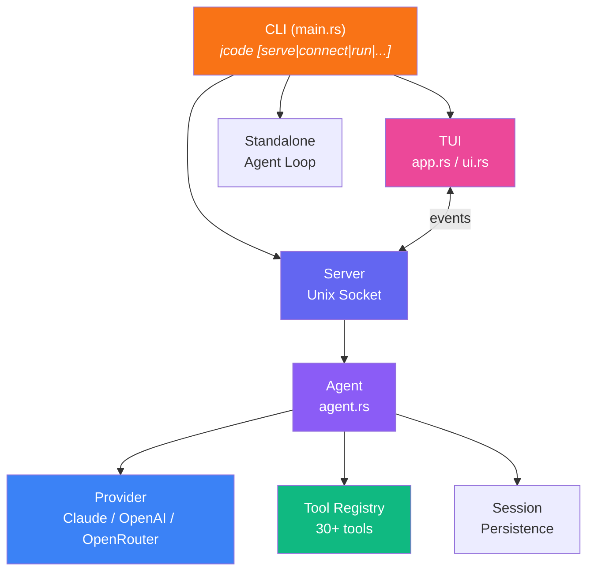

**Data Flow:**
1. User input enters via TUI or CLI
2. Server routes requests to the appropriate Agent session
3. Agent sends messages to Provider, receives streaming response
4. Tool calls are executed via the Registry
5. Session state is persisted to `~/.jcode/sessions/`

</details>

<details>
<summary><strong>Provider System</strong></summary>

<br>

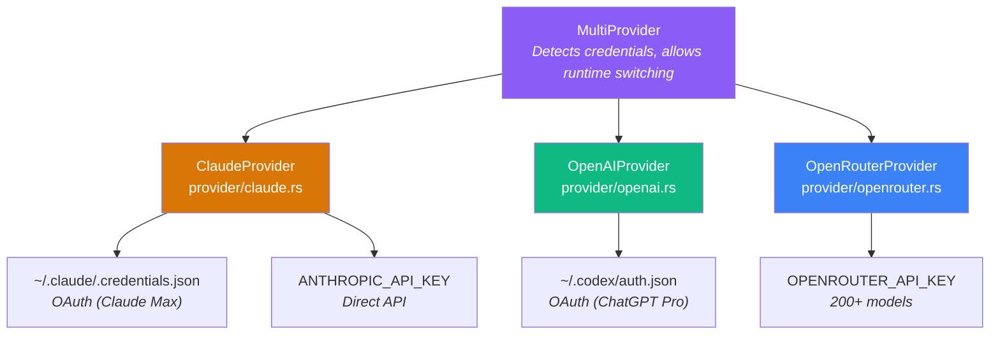

**Key Design:**
- `MultiProvider` detects available credentials at startup
- Seamless runtime switching between providers with `/model` command
- Claude direct API with OAuth - no API key needed with a subscription
- OpenRouter gives access to 200+ models from all major providers

</details>

<details>
<summary><strong>Tool System</strong></summary>

<br>

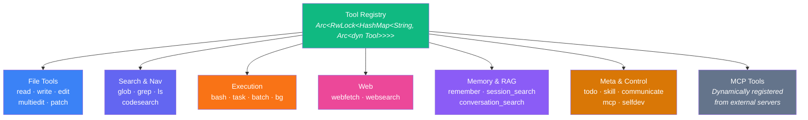

**Tool Trait:**
```rust
#[async_trait]
trait Tool: Send + Sync {
    fn name(&self) -> &str;
    fn description(&self) -> &str;
    fn parameters_schema(&self) -> Value;
    async fn execute(&self, input: Value, ctx: ToolContext) -> Result<ToolOutput>;
}
```

</details>

<details>
<summary><strong>Server & Swarm Coordination</strong></summary>

<br>

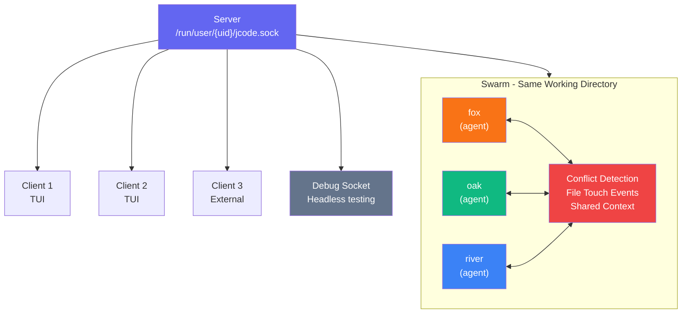

**Protocol (newline-delimited JSON over Unix socket):**
- **Requests:** Message, Cancel, Subscribe, ResumeSession, CycleModel, SetModel, CommShare, CommMessage, ...
- **Events:** TextDelta, ToolStart, ToolResult, TurnComplete, TokenUsage, Notification, SwarmStatus, ...

</details>

<details>
<summary><strong>TUI Rendering</strong></summary>

<br>

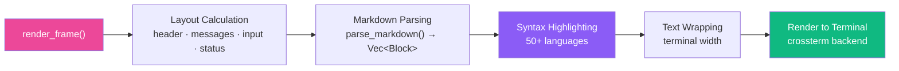

**Rendering Performance:**

| Mode | Avg Frame Time | FPS | Memory |
|---|---|---|---|
| Idle (200 turns) | 0.68 ms | 1,475 | 18 MB |
| Streaming | 0.67 ms | 1,498 | 18 MB |

*Measured with 200 conversation turns, full markdown + syntax highlighting, 120×40 terminal.*

**Key UI Components:**
- **InfoWidget** - floating panel showing model, context usage, todos, session count
- **Session Picker** - interactive split-pane browser with conversation previews
- **Mermaid Diagrams** - rendered natively as inline images (Sixel/Kitty/iTerm2 protocols)
- **Visual Debug** - frame-by-frame capture for debugging rendering

</details>

<details>
<summary><strong>Session & Memory</strong></summary>

<br>

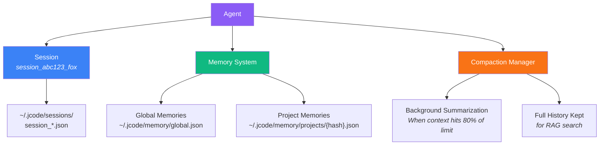

**Compaction:** When context approaches the token limit, older turns are summarized in the background while recent turns are kept verbatim. Full history is always available for RAG search.

**Memory Categories:** `Fact` · `Preference` · `Entity` · `Correction` - with semantic search, graph traversal, and automatic extraction at session end.

</details>

<details>
<summary><strong>MCP Integration</strong></summary>

<br>

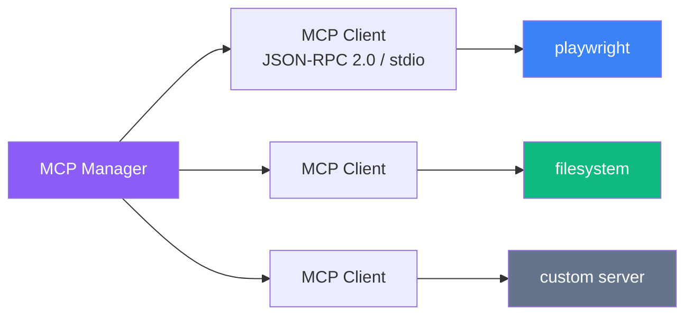

Configure in `.claude/mcp.json` (project) or `~/.claude/mcp.json` (global):

```json
{
  "servers": {
    "playwright": {
      "command": "npx",
      "args": ["@anthropic/mcp-playwright"]
    }
  }
}
```

Tools are auto-registered as `mcp__servername__toolname` and available immediately.

</details>

<details>
<summary><strong>Self-Dev Mode</strong></summary>

<br>

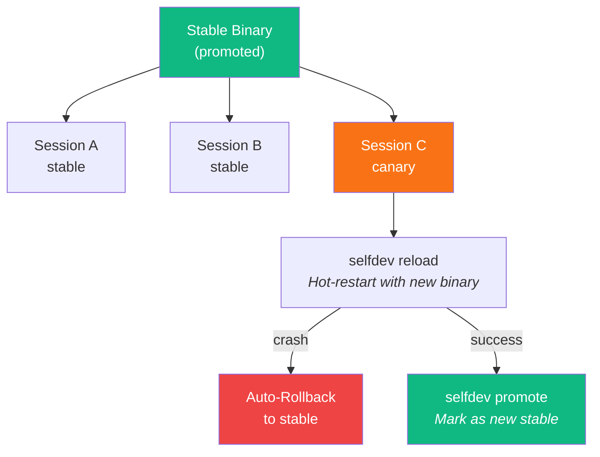

jcode can develop itself - edit code, build, hot-reload, and test in-place. If the canary crashes, it auto-rolls back to the last stable binary and wakes with crash context.

</details>

<details>
<summary><strong>Module Map</strong></summary>

<br>

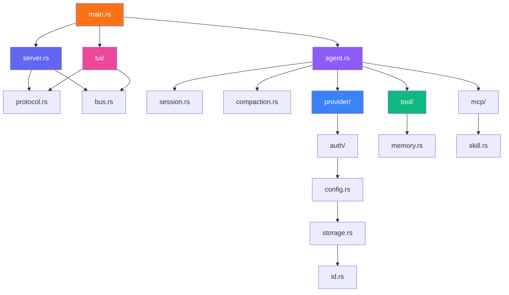

**~92,000 lines of Rust** across 106 source files.

</details>

---

<div align="center">

## OpenClaw — Ambient Mode

</div>

OpenClaw is jcode's always-on autonomous agent. When you're not actively coding, it runs in the background — gardening your memory graph, doing proactive work, and staying reachable via Telegram.

Think of it like a brain consolidating memories during sleep: it merges duplicates, resolves contradictions, verifies stale facts against your codebase, and extracts missed context from crashed sessions.

**Key capabilities:**

- **Memory gardening** — consolidates duplicates, prunes dead memories, discovers new relationships, backfills embeddings
- **Proactive work** — analyzes recent sessions and git history to identify useful tasks you'd appreciate being surprised by
- **Telegram integration** — sends status updates and accepts directives mid-cycle via bot replies
- **Self-scheduling** — the agent decides when to wake next, constrained by adaptive resource limits that never starve interactive sessions
- **Safety-first** — code changes go on worktree branches with permission requests; conservative by default

<details>
<summary><strong>Ambient Cycle Architecture</strong></summary>

<br>

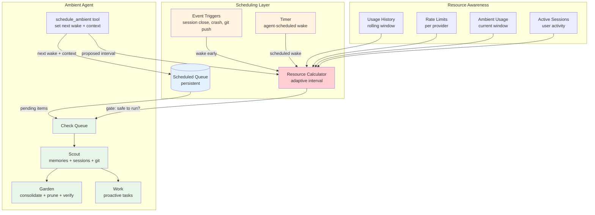

</details>

<details>
<summary><strong>Two-Layer Memory Consolidation</strong></summary>

<br>

Memory consolidation happens at two levels — fast inline checks during sessions, and deep graph-wide passes during ambient cycles:

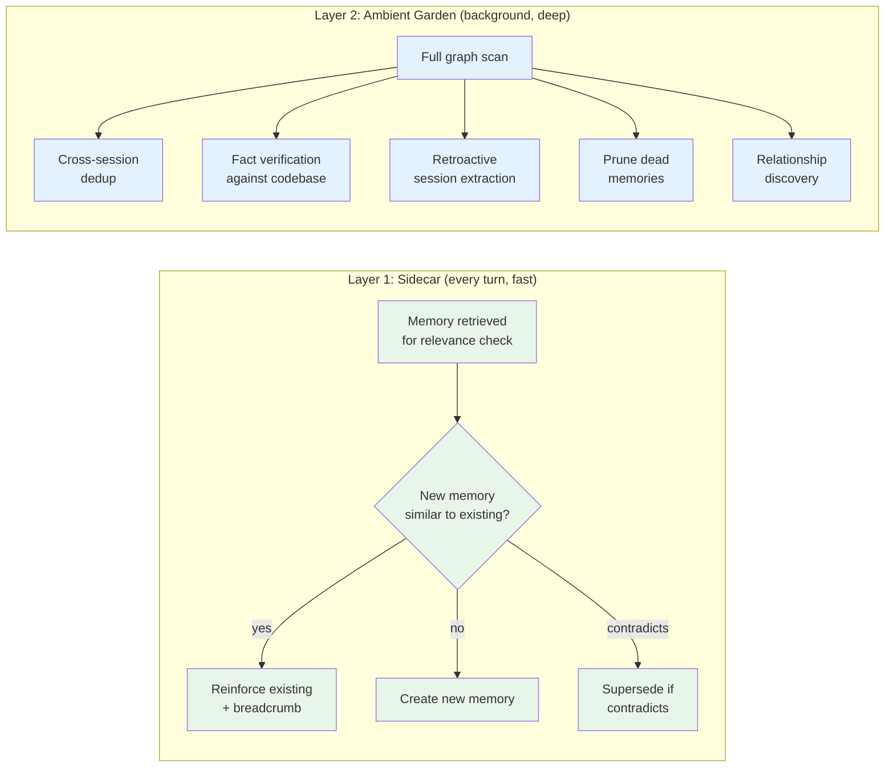

</details>

<details>
<summary><strong>Provider Selection & Scheduling</strong></summary>

<br>

OpenClaw prefers subscription-based providers (OAuth) so ambient cycles never burn API credits silently:

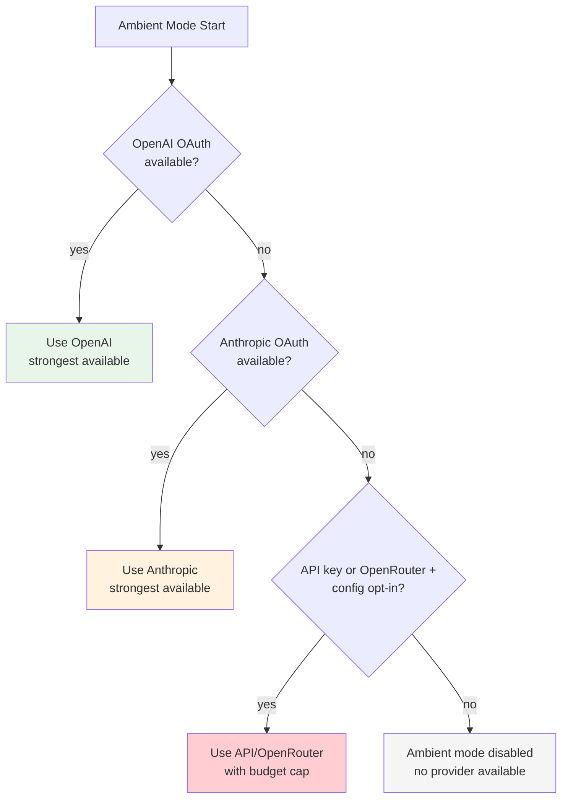

The system adapts scheduling based on rate limit headers, user activity, and budget:

| Condition | Behavior |
|-----------|----------|
| User is active | Pause or throttle heavily |
| User idle for hours | Run more frequently |
| Hit a rate limit | Exponential backoff |
| Approaching end of window with budget left | Squeeze in extra cycles |

</details>

---

<div align="center">

## Environment Variables

| Variable | Description |
|---|---|
| `ANTHROPIC_API_KEY` | Direct API key (overrides OAuth) |
| `OPENROUTER_API_KEY` | OpenRouter API key |
| `JCODE_ANTHROPIC_MODEL` | Override default Claude model |
| `JCODE_OPENROUTER_MODEL` | Override default OpenRouter model |
| `JCODE_ANTHROPIC_DEBUG` | Log API request payloads |

</div>

---

<div align="center">

## macOS Notes

</div>

jcode runs natively on macOS (Apple Silicon & Intel). Key differences:

- **Sockets** use `$TMPDIR` instead of `$XDG_RUNTIME_DIR` (override with `$JCODE_RUNTIME_DIR`)
- **Clipboard** uses `osascript` / `NSPasteboard` for image paste
- **Terminal spawning** auto-detects Kitty, WezTerm, Alacritty, iTerm2, Terminal.app
- **Mermaid diagrams** rendered via pure-Rust SVG with Core Text font discovery

---

<div align="center">

## Testing

</div>

```bash
cargo test                          # All tests
cargo test --test e2e               # End-to-end only
cargo run --bin jcode-harness       # Tool harness (--include-network for web)
scripts/agent_trace.sh              # Full agent smoke test
```

---

<div align="center">

**Built with Rust** · **MIT License**

[GitHub](https://github.com/1jehuang/jcode) · [Report Bug](https://github.com/1jehuang/jcode/issues) · [Request Feature](https://github.com/1jehuang/jcode/issues)

</div>
