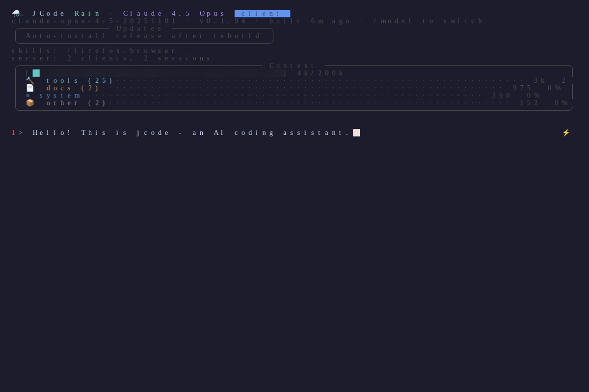
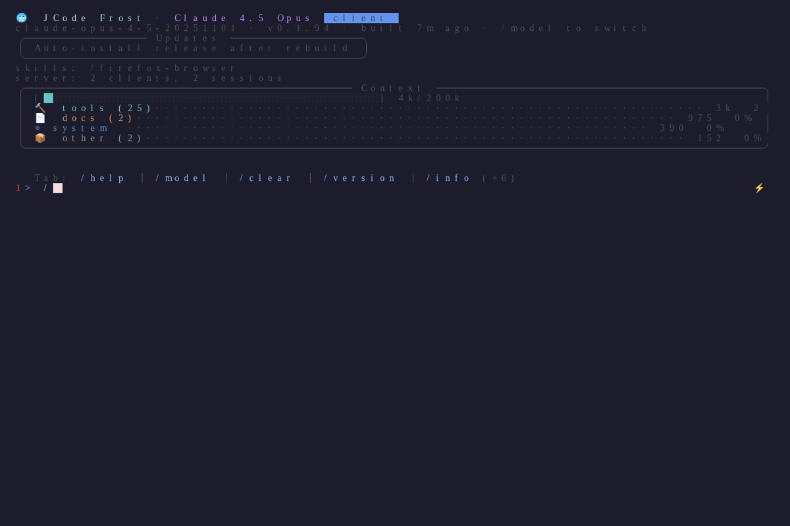
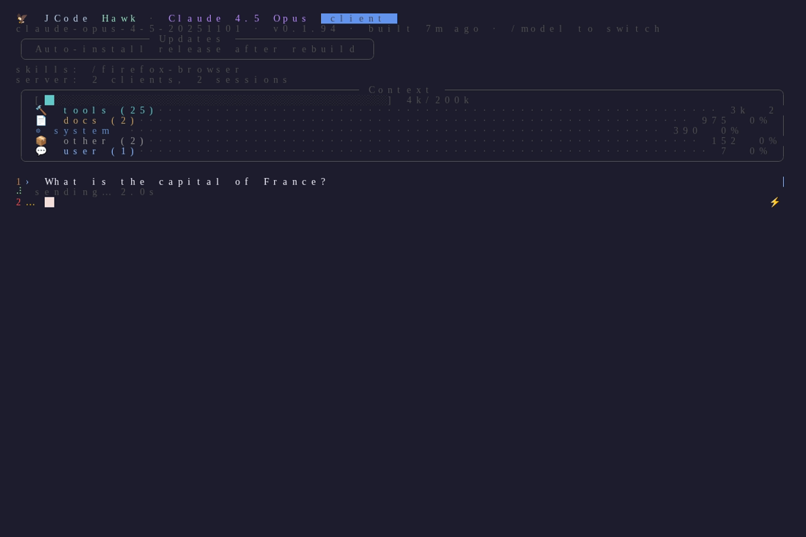

# J-Code

A Rust coding agent that uses the official **Claude Agent SDK** (Claude Code) or **ChatGPT Pro** via OAuth.

## Screenshots

<details open>
<summary><strong>Main Interface</strong></summary>



*The main interface showing the InfoWidget with context usage, tool counts, and the input area.*

</details>

<details>
<summary><strong>Command Palette</strong></summary>



*The command palette (triggered with `/`) showing available commands and shortcuts.*

</details>

<details>
<summary><strong>Streaming Response</strong></summary>



*A streaming response in progress, showing the "sending..." status indicator.*

</details>

## Features

- **No API keys needed** - Uses Claude Code CLI credentials and Codex OAuth
- **Dual provider support** - Works with Claude Agent SDK and OpenAI/Codex
- **Streaming responses** - Real-time output as the model generates
- **Server/Client architecture** - Run as daemon, connect from multiple clients
- **20+ built-in tools** - File ops, search, web, shell, memory, and parallel execution
- **MCP support** - Extend with Model Context Protocol servers
- **Cross-session memory** - Learns and remembers across sessions
- **Swarm coordination** - Multiple agents can work together with conflict detection

## Prerequisites

You need at least one of:
- **Claude Max subscription** - Install the SDK: `pip install claude-agent-sdk`, then run `claude` to authenticate
- **ChatGPT Pro/Plus subscription** - Run `codex login` to authenticate

## Installation

```bash
cargo install --path .
```

Or build from source:
```bash
cargo build --release
./target/release/jcode
```

## Usage

```bash
# Interactive TUI (default - connects to server or starts one)
jcode

# Run a single command
jcode run "Create a hello world program in Python"

# Start as background server
jcode serve

# Connect to running server
jcode connect

# Specify provider explicitly
jcode --provider claude
jcode --provider openai

# Change working directory
jcode -C /path/to/project

# Resume a previous session
jcode --resume fox  # by memorable name
jcode --resume session_abc123_fox  # by full ID
```

## Tools

| Tool | Description |
|------|-------------|
| `bash` | Execute shell commands |
| `read` | Read file contents with line numbers |
| `write` | Create or overwrite files |
| `edit` | Edit files by replacing text |
| `multiedit` | Apply multiple edits to one file |
| `patch` | Apply unified diff patches |
| `glob` | Find files by pattern |
| `grep` | Search file contents with regex |
| `ls` | List directory contents |
| `webfetch` | Fetch URL content |
| `websearch` | Search the web (DuckDuckGo) |
| `codesearch` | Search code/documentation via Exa |
| `skill` | Load a skill from SKILL.md |
| `task` | Run a delegated sub-task |
| `todowrite` | Update todo list |
| `todoread` | Read todo list |
| `remember` | Store persistent memories |
| `session_search` | Search past sessions (RAG) |
| `conversation_search` | Search current conversation |
| `communicate` | Send messages to other agents |
| `bg` | Run tasks in background |
| `batch` | Execute up to 10 tools in parallel |
| `mcp` | Manage MCP server connections |

---

## Architecture

<details>
<summary><strong>High-Level Architecture</strong></summary>

```
┌─────────────────────────────────────────────────────────────────┐
│                        CLI (main.rs)                            │
│  jcode [serve|connect|run|repl|login|update|self-dev]          │
└─────────────────────────────────────────────────────────────────┘
                              │
              ┌───────────────┼───────────────┐
              ▼               ▼               ▼
┌─────────────────┐  ┌─────────────┐  ┌─────────────────┐
│   TUI (app.rs)  │  │   Server    │  │  Standalone     │
│   - Rendering   │◄─│ (Unix Sock) │  │  Agent Loop     │
│   - Input       │  │             │  │  (--standalone) │
│   - State       │  └──────┬──────┘  └─────────────────┘
└─────────────────┘         │
                            ▼
              ┌─────────────────────────┐
              │    Agent (agent.rs)     │
              │  - Turn loop            │
              │  - Tool execution       │
              │  - Session management   │
              └───────────┬─────────────┘
                          │
          ┌───────────────┼───────────────┐
          ▼               ▼               ▼
┌─────────────────┐ ┌───────────┐ ┌─────────────────┐
│    Provider     │ │  Registry │ │    Session      │
│  (Claude/OpenAI)│ │  (Tools)  │ │  (Persistence)  │
└─────────────────┘ └───────────┘ └─────────────────┘
```

**Data Flow:**
1. User input enters via TUI or CLI
2. Server routes requests to appropriate Agent session
3. Agent sends messages to Provider, receives streaming response
4. Tool calls are executed via Registry
5. Session state is persisted to `~/.jcode/sessions/`

</details>

<details>
<summary><strong>Provider System</strong></summary>

```
┌─────────────────────────────────────────────────────────────────┐
│                    MultiProvider (provider/mod.rs)              │
│  - Detects available credentials on startup                     │
│  - Allows runtime model switching across providers              │
│  - Defaults to Claude if available, otherwise OpenAI            │
└─────────────────────────────────────────────────────────────────┘
                              │
              ┌───────────────┴───────────────┐
              ▼                               ▼
┌─────────────────────────┐     ┌─────────────────────────┐
│   ClaudeProvider        │     │   OpenAIProvider        │
│   (provider/claude.rs)  │     │   (provider/openai.rs)  │
├─────────────────────────┤     ├─────────────────────────┤
│ - Claude Agent SDK      │     │ - Codex OAuth           │
│ - Subprocess bridge     │     │ - Direct HTTP API       │
│ - Tool execution by SDK │     │ - Local tool execution  │
│ - Session resume        │     │ - Reasoning effort ctrl │
└─────────────────────────┘     └─────────────────────────┘
         │                               │
         ▼                               ▼
┌─────────────────────────┐     ┌─────────────────────────┐
│ ~/.claude/              │     │ ~/.codex/auth.json      │
│   .credentials.json     │     │                         │
└─────────────────────────┘     └─────────────────────────┘

Provider Trait:
┌─────────────────────────────────────────────────────────────────┐
│ trait Provider: Send + Sync {                                   │
│     async fn complete(...) -> Result<EventStream>;              │
│     fn name(&self) -> &str;                                     │
│     fn model(&self) -> String;                                  │
│     fn set_model(&self, model: &str) -> Result<()>;            │
│     fn handles_tools_internally(&self) -> bool;                 │
│     fn supports_compaction(&self) -> bool;                      │
│ }                                                               │
└─────────────────────────────────────────────────────────────────┘
```

**Key Design Decisions:**
- `MultiProvider` allows seamless switching between Claude and OpenAI mid-session
- Claude SDK handles tool execution internally; OpenAI requires local execution
- Credentials are loaded lazily and cached

</details>

<details>
<summary><strong>Tool System & Registry</strong></summary>

```
┌─────────────────────────────────────────────────────────────────┐
│                    Registry (tool/mod.rs)                       │
│  Arc<RwLock<HashMap<String, Arc<dyn Tool>>>>                   │
├─────────────────────────────────────────────────────────────────┤
│ Methods:                                                        │
│  - new(provider) -> Self           Create with default tools   │
│  - definitions() -> Vec<ToolDef>   Get schemas for API         │
│  - execute(name, input, ctx)       Run a tool                  │
│  - register(name, tool)            Add tool dynamically (MCP)  │
│  - unregister_prefix(prefix)       Remove tools (MCP cleanup)  │
└─────────────────────────────────────────────────────────────────┘
                              │
    ┌─────────────────────────┼─────────────────────────┐
    │                         │                         │
    ▼                         ▼                         ▼
┌─────────────┐       ┌─────────────┐       ┌─────────────────┐
│ File Tools  │       │ Search/Nav  │       │ Execution       │
├─────────────┤       ├─────────────┤       ├─────────────────┤
│ read        │       │ glob        │       │ bash            │
│ write       │       │ grep        │       │ task (subagent) │
│ edit        │       │ ls          │       │ batch (parallel)│
│ multiedit   │       │ codesearch  │       │ bg (background) │
│ patch       │       │             │       │                 │
│ apply_patch │       │             │       │                 │
└─────────────┘       └─────────────┘       └─────────────────┘
    │                         │                         │
    ▼                         ▼                         ▼
┌─────────────┐       ┌─────────────┐       ┌─────────────────┐
│ Web Tools   │       │ Memory/RAG  │       │ Meta/Control    │
├─────────────┤       ├─────────────┤       ├─────────────────┤
│ webfetch    │       │ remember    │       │ todowrite/read  │
│ websearch   │       │ session_    │       │ skill_manage    │
│             │       │   search    │       │ communicate     │
│             │       │ conversation│       │ mcp             │
│             │       │   _search   │       │ selfdev         │
└─────────────┘       └─────────────┘       └─────────────────┘

Tool Trait:
┌─────────────────────────────────────────────────────────────────┐
│ #[async_trait]                                                  │
│ trait Tool: Send + Sync {                                       │
│     fn name(&self) -> &str;                                     │
│     fn description(&self) -> &str;                              │
│     fn parameters_schema(&self) -> Value;  // JSON Schema       │
│     async fn execute(&self, input: Value, ctx: ToolContext)    │
│         -> Result<ToolOutput>;                                  │
│ }                                                               │
└─────────────────────────────────────────────────────────────────┘
```

**Tool Categories:**
- **File Tools**: Direct filesystem operations with line-number tracking
- **Search Tools**: Pattern matching, regex search, directory listing
- **Execution**: Shell commands, sub-agents, parallel execution
- **Web Tools**: HTTP fetch, search engines
- **Memory**: Cross-session persistence and RAG retrieval
- **Meta**: Todo tracking, skill loading, inter-agent communication

</details>

<details>
<summary><strong>Server Architecture & Swarm</strong></summary>

```
┌─────────────────────────────────────────────────────────────────┐
│                    Server (server.rs)                           │
│  Listens on: /run/user/{uid}/jcode.sock (or $JCODE_SOCKET)     │
└─────────────────────────────────────────────────────────────────┘
        │
        │  Unix Socket (newline-delimited JSON)
        │
        ├──────────────┬──────────────┬──────────────┐
        ▼              ▼              ▼              ▼
┌─────────────┐ ┌─────────────┐ ┌─────────────┐ ┌─────────────┐
│  Client 1   │ │  Client 2   │ │  Client 3   │ │   Debug     │
│  (TUI)      │ │  (TUI)      │ │  (External) │ │   Socket    │
└─────────────┘ └─────────────┘ └─────────────┘ └─────────────┘

Server State:
┌─────────────────────────────────────────────────────────────────┐
│ sessions: HashMap<String, Arc<Mutex<Agent>>>                   │
│ swarm_members: HashMap<String, SwarmMember>                    │
│ swarms_by_cwd: HashMap<PathBuf, HashSet<String>>              │
│ file_touches: HashMap<PathBuf, Vec<FileAccess>>               │
│ shared_context: HashMap<PathBuf, HashMap<String, SharedCtx>>  │
│ event_tx: broadcast::Sender<ServerEvent>                       │
└─────────────────────────────────────────────────────────────────┘

Swarm Coordination:
┌─────────────────────────────────────────────────────────────────┐
│                    Same Working Directory                       │
├─────────────────────────────────────────────────────────────────┤
│  ┌─────────┐        ┌─────────┐        ┌─────────┐             │
│  │ fox     │◄──────►│ oak     │◄──────►│ river   │             │
│  │ (agent) │        │ (agent) │        │ (agent) │             │
│  └────┬────┘        └────┬────┘        └────┬────┘             │
│       │                  │                  │                   │
│       └──────────────────┼──────────────────┘                   │
│                          ▼                                      │
│              ┌─────────────────────┐                           │
│              │  File Touch Events  │                           │
│              │  Conflict Detection │                           │
│              │  Shared Context     │                           │
│              └─────────────────────┘                           │
└─────────────────────────────────────────────────────────────────┘
```

**Protocol (protocol.rs):**
```
Request types:  Message, Cancel, Clear, Ping, Subscribe, GetHistory,
                ResumeSession, CycleModel, SetModel, Reload,
                CommShare, CommRead, CommMessage, CommList

Event types:    Ack, TextDelta, ToolStart, ToolResult, TurnComplete,
                Error, History, TokenUsage, ModelChanged, Notification
```

</details>

<details>
<summary><strong>TUI & Rendering Architecture</strong></summary>

```
┌─────────────────────────────────────────────────────────────────┐
│                      App (tui/app.rs)                           │
│  262KB - Main TUI application state and logic                  │
├─────────────────────────────────────────────────────────────────┤
│ State:                                                          │
│  - display_messages: Vec<DisplayMessage>                       │
│  - streaming_text: String (current response buffer)            │
│  - input: String (user input buffer)                           │
│  - scroll_offset: usize                                        │
│  - processing_status: ProcessingStatus                         │
│  - queued_messages: Vec<String>                                │
└─────────────────────────────────────────────────────────────────┘
                              │
              ┌───────────────┼───────────────┐
              ▼               ▼               ▼
┌─────────────────┐  ┌─────────────┐  ┌─────────────────┐
│    ui.rs        │  │ keybind.rs  │  │  markdown.rs    │
│  100KB render   │  │  Keybinds   │  │  MD→styled text │
│  draw(frame,    │  │  handling   │  │  syntax hilite  │
│    state)       │  │             │  │                 │
└─────────────────┘  └─────────────┘  └─────────────────┘

Rendering Pipeline:
┌─────────────────────────────────────────────────────────────────┐
│                    render_frame(frame, state)                   │
├─────────────────────────────────────────────────────────────────┤
│  1. Layout calculation (header, messages, input, status)       │
│  2. For each DisplayMessage:                                    │
│     ├─► parse_markdown() → Vec<MarkdownBlock>                  │
│     ├─► syntax_highlight() for code blocks                     │
│     └─► wrap_text() for terminal width                         │
│  3. Render streaming_text with partial markdown                │
│  4. Render tool call widgets (collapsible, with status icons)  │
│  5. Render input line with cursor                              │
│  6. Render status bar (tokens, model, session info)            │
└─────────────────────────────────────────────────────────────────┘

TuiState Trait (30+ methods):
┌─────────────────────────────────────────────────────────────────┐
│ Implemented by both App (standalone) and ClientApp (remote)    │
│                                                                 │
│ fn display_messages(&self) -> &[DisplayMessage];               │
│ fn streaming_text(&self) -> &str;                              │
│ fn input(&self) -> &str;                                       │
│ fn is_processing(&self) -> bool;                               │
│ fn provider_name(&self) -> String;                             │
│ fn provider_model(&self) -> String;                            │
│ fn streaming_tokens(&self) -> (u64, u64);                      │
│ fn status(&self) -> ProcessingStatus;                          │
│ fn scroll_offset(&self) -> usize;                              │
│ fn animation_elapsed(&self) -> f32;                            │
│ ...                                                             │
└─────────────────────────────────────────────────────────────────┘

Backend Abstraction (backend.rs):
┌─────────────────────────────────────────────────────────────────┐
│ ┌─────────────────────┐         ┌─────────────────────┐        │
│ │   LocalBackend      │         │   RemoteConnection  │        │
│ │   (standalone mode) │         │   (client mode)     │        │
│ ├─────────────────────┤         ├─────────────────────┤        │
│ │ Direct Agent access │         │ Unix socket to      │        │
│ │ In-process events   │         │ server, JSON events │        │
│ └─────────────────────┘         └─────────────────────┘        │
│            │                              │                     │
│            └──────────┬───────────────────┘                     │
│                       ▼                                         │
│              BackendEvent enum                                  │
│              (TextDelta, ToolStart, ToolDone, etc.)            │
└─────────────────────────────────────────────────────────────────┘

UI Layout:
┌─────────────────────────────────────────────────────────────────┐
│ [claude-opus-4-5] [fox] [2 clients] [▶ running]    ◀─ Status   │
├─────────────────────────────────────────────────────────────────┤
│                                                                 │
│  User: Help me fix the bug in auth.rs                          │
│                                                                 │
│  Assistant: I'll look at that file...                          │
│  ┌─────────────────────────────────────────┐                   │
│  │ read auth.rs (245 lines)                │  ◀─ Tool calls    │
│  └─────────────────────────────────────────┘                   │
│                                                                 │
│  The issue is on line 45...                                    │
│                                                                 │
├─────────────────────────────────────────────────────────────────┤
│ > Type your message here...                        ◀─ Input    │
├─────────────────────────────────────────────────────────────────┤
│ Streaming... 1.2k in / 456 out                    ◀─ Progress  │
└─────────────────────────────────────────────────────────────────┘
```

**Key Files:**
- `tui/app.rs` (262KB) - Main application state, event loop
- `tui/ui.rs` (100KB) - Frame rendering, layout
- `tui/markdown.rs` (23KB) - Markdown parsing, syntax highlighting
- `tui/core.rs` (15KB) - Shared state between local/remote modes
- `tui/backend.rs` (13KB) - Backend abstraction, debug events
- `tui/client.rs` (34KB) - Remote client implementation
- `tui/keybind.rs` (8KB) - Keyboard shortcut handling
- `tui/info_widget.rs` (25KB) - Floating info panel
- `tui/session_picker.rs` (15KB) - Session browser with preview
- `tui/visual_debug.rs` (8KB) - Frame capture for debugging

</details>

<details>
<summary><strong>UI Features</strong></summary>

### InfoWidget (Floating Panel)

See the [Main Interface screenshot](#screenshots) above. The InfoWidget shows:

- **Model info**: Current model name and reasoning effort level
- **Session count**: Active sessions in the swarm
- **Context bar**: Visual progress bar of token usage (e.g., "4k/200k")
- **Tool categories**: Breakdown of available tools by category
- **Todo list**: Current tasks with status icons (◐ in_progress, ✓ completed, ○ pending)

**Controls:**
- Toggle visibility: `Ctrl+I`
- Auto-positions in largest empty screen area
- Pages between expanded views every 30 seconds

### Command Palette

Press `/` to open the command palette (see [screenshot](#screenshots)):

| Command | Description |
|---------|-------------|
| `/help` | Show all commands |
| `/model` | Switch AI model |
| `/clear` | Clear conversation |
| `/version` | Show version info |
| `/info` | Toggle InfoWidget |
| `/sessions` | Browse past sessions |

### Session Picker

When resuming sessions (`jcode --resume` or `/sessions`), an interactive browser shows:

- Split view: session list (left) + conversation preview (right)
- Session status: ▶ active, ✓ closed, 💥 crashed, 🔄 reloaded
- Memorable animal names with emoji icons
- Message count, token estimate, timestamps
- Keyboard navigation: `↑/↓` navigate, `Enter` select, `q` quit

### Visual Debug Mode

Frame-by-frame capture for debugging rendering:

```
/debug-visual on    # Enable capture
/debug-visual off   # Disable
/debug-visual dump  # Write to ~/.jcode/visual-debug.txt
```

Captures terminal dimensions, layout areas, state snapshots, and rendered text. Ring buffer keeps last 100 frames.

</details>

<details>
<summary><strong>Rendering Benchmarks</strong></summary>

```
┌─────────────────────────────────────────────────────────────────┐
│                    tui_bench (bin/tui_bench.rs)                 │
│  Autonomous rendering benchmark for performance testing        │
└─────────────────────────────────────────────────────────────────┘

Usage:
  cargo run --release --bin tui_bench -- [OPTIONS]

Options:
  --frames <N>        Number of frames to render (default: 300)
  --width <W>         Terminal width (default: 120)
  --height <H>        Terminal height (default: 40)
  --turns <N>         Number of message turns (default: 200)
  --user-len <N>      User message length in chars (default: 120)
  --assistant-len <N> Assistant message length (default: 600)
  --stream-chunk <N>  Streaming chunk size (default: 80)
  --scroll-cycle <N>  Scroll animation cycle length (default: 80)
  --mode <MODE>       idle | streaming (default: idle)

Benchmark Modes:
┌─────────────────────────────────────────────────────────────────┐
│ Idle Mode:                                                      │
│   - Renders static conversation history                        │
│   - Tests markdown parsing + layout performance                │
│   - Simulates scrolling through history                        │
│                                                                 │
│ Streaming Mode:                                                 │
│   - Simulates active streaming response                        │
│   - Incrementally grows streaming_text each frame              │
│   - Tests real-time rendering performance                      │
└─────────────────────────────────────────────────────────────────┘

Output:
  mode: Idle
  frames: 300
  total_ms: 245.67
  avg_ms: 0.82
  fps: 1221.3

Performance Targets:
  - Idle:      < 1ms/frame (1000+ fps headroom)
  - Streaming: < 2ms/frame (500+ fps headroom)
  - With 200 turns of history + markdown + syntax highlighting
```

**What It Measures:**
- Markdown parsing throughput
- Syntax highlighting performance
- Text wrapping and layout calculation
- Scroll offset handling
- Widget rendering overhead

</details>

<details>
<summary><strong>MCP (Model Context Protocol) Integration</strong></summary>

```
┌─────────────────────────────────────────────────────────────────┐
│                 MCP Manager (mcp/manager.rs)                    │
│  Manages lifecycle of external MCP tool servers                │
└─────────────────────────────────────────────────────────────────┘
                              │
                              ▼
┌─────────────────────────────────────────────────────────────────┐
│               MCP Client (mcp/client.rs)                        │
│  JSON-RPC 2.0 over stdio to each server                        │
├─────────────────────────────────────────────────────────────────┤
│ Methods:                                                        │
│  - initialize()      Handshake with server                     │
│  - list_tools()      Get available tools                       │
│  - call_tool(name, args)  Execute a tool                       │
└─────────────────────────────────────────────────────────────────┘
        │                           │                      │
        ▼                           ▼                      ▼
┌─────────────────┐     ┌─────────────────┐     ┌─────────────────┐
│ MCP Server 1    │     │ MCP Server 2    │     │ MCP Server 3    │
│ (playwright)    │     │ (filesystem)    │     │ (custom)        │
│                 │     │                 │     │                 │
│ stdin <-------> │     │ stdin <-------> │     │ stdin <-------> │
│        stdout   │     │        stdout   │     │        stdout   │
└─────────────────┘     └─────────────────┘     └─────────────────┘

Config (~/.claude/mcp.json or .claude/mcp.json):
┌─────────────────────────────────────────────────────────────────┐
│ {                                                               │
│   "servers": {                                                  │
│     "playwright": {                                             │
│       "command": "npx",                                         │
│       "args": ["@anthropic/mcp-playwright"],                    │
│       "env": {}                                                 │
│     }                                                           │
│   }                                                             │
│ }                                                               │
└─────────────────────────────────────────────────────────────────┘

Tool Naming: mcp__{server}__{tool}
Example: mcp__playwright__screenshot
```

</details>

<details>
<summary><strong>Session & Memory System</strong></summary>

```
┌─────────────────────────────────────────────────────────────────┐
│                   Session (session.rs)                          │
├─────────────────────────────────────────────────────────────────┤
│ struct Session {                                                │
│     id: String,              // "session_abc123_fox"            │
│     short_name: String,      // "fox" (memorable)               │
│     parent_id: Option<String>,                                  │
│     messages: Vec<StoredMessage>,                               │
│     status: SessionStatus,   // Active/Closed/Crashed/...      │
│     is_canary: bool,         // Self-dev testing               │
│     working_dir: String,                                        │
│ }                                                               │
└─────────────────────────────────────────────────────────────────┘
                              │
                              ▼
┌─────────────────────────────────────────────────────────────────┐
│                   Storage Layout                                │
├─────────────────────────────────────────────────────────────────┤
│ ~/.jcode/                                                       │
│ ├── sessions/                                                   │
│ │   ├── session_abc123_fox.json                                │
│ │   ├── session_def456_oak.json                                │
│ │   └── ...                                                     │
│ ├── memory/                                                     │
│ │   ├── global.json          # User-wide memories              │
│ │   └── projects/                                              │
│ │       └── {hash}.json      # Per-directory memories          │
│ ├── build_number             # Auto-increment patch version    │
│ └── logs/                    # Debug logs                      │
└─────────────────────────────────────────────────────────────────┘

Memory System (memory.rs):
┌─────────────────────────────────────────────────────────────────┐
│ struct MemoryEntry {                                            │
│     id: String,                                                 │
│     category: Fact | Preference | Entity | Correction,         │
│     content: String,                                            │
│     tags: Vec<String>,                                         │
│     access_count: u32,                                         │
│     source: Option<String>,  // Session that created it        │
│ }                                                               │
└─────────────────────────────────────────────────────────────────┘
```

</details>

<details>
<summary><strong>Compaction System</strong></summary>

```
┌─────────────────────────────────────────────────────────────────┐
│              CompactionManager (compaction.rs)                  │
│  Background summarization when context approaches token limit   │
└─────────────────────────────────────────────────────────────────┘

Token Budget: 100k tokens
Threshold: 80% (triggers compaction)
Keep Recent: 10 turns verbatim

Flow:
┌─────────────────────────────────────────────────────────────────┐
│                                                                 │
│  [Turn 1] [Turn 2] ... [Turn N-10] | [Turn N-9] ... [Turn N]   │
│  <------ To be summarized -------> | <---- Keep verbatim ----> │
│                                    |                            │
│                    v               |                            │
│         ┌─────────────────────┐    |                            │
│         │ Background Task     │    |                            │
│         │ (Summarize early    │    |                            │
│         │  turns)             │    |                            │
│         └──────────┬──────────┘    |                            │
│                    v               |                            │
│         ┌─────────────────────┐    |                            │
│         │ Summary             │    |                            │
│         │ "Context: Working   │    |                            │
│         │  on auth bug..."    │    |                            │
│         └─────────────────────┘    |                            │
│                                    |                            │
└─────────────────────────────────────────────────────────────────┘

After Compaction:
┌─────────────────────────────────────────────────────────────────┐
│ [Summary] | [Turn N-9] [Turn N-8] ... [Turn N]                 │
│           | <----------- Recent turns (verbatim) ------------> │
└─────────────────────────────────────────────────────────────────┘

RAG Support: Full history kept in full_history for search
```

</details>

<details>
<summary><strong>Event Bus</strong></summary>

```
┌─────────────────────────────────────────────────────────────────┐
│                    Bus (bus.rs)                                 │
│  Global broadcast channel for internal events                  │
│  static INSTANCE: OnceLock<Bus>                                │
└─────────────────────────────────────────────────────────────────┘
                              │
                              │ broadcast::channel(256)
                              │
    ┌─────────────────────────┼─────────────────────────┐
    │                         │                         │
    ▼                         ▼                         ▼
┌─────────────┐       ┌─────────────┐       ┌─────────────────┐
│ ToolUpdated │       │ TodoUpdated │       │ FileTouch       │
│ - session   │       │ - session   │       │ - session       │
│ - tool_name │       │ - todos     │       │ - path          │
│ - status    │       │             │       │ - op (r/w/edit) │
│ - title     │       │             │       │ - summary       │
└─────────────┘       └─────────────┘       └─────────────────┘
    │                         │                         │
    ▼                         ▼                         ▼
┌─────────────┐       ┌─────────────┐       ┌─────────────────┐
│ Subagent    │       │ Background  │       │                 │
│ Status      │       │ Task        │       │                 │
│ - session   │       │ Completed   │       │                 │
│ - status    │       │ - task_id   │       │                 │
│   text      │       │ - output    │       │                 │
└─────────────┘       └─────────────┘       └─────────────────┘

Subscribers:
- TUI (for live status updates)
- Server (for swarm conflict detection)
- Tools (for coordination)
```

</details>

<details>
<summary><strong>Self-Dev Mode</strong></summary>

```
┌─────────────────────────────────────────────────────────────────┐
│                  Self-Development Workflow                      │
│  Hot-reload loop for developing jcode itself                   │
└─────────────────────────────────────────────────────────────────┘

                    ┌─────────────────┐
                    │  Stable Binary  │
                    │  (promoted)     │
                    └────────┬────────┘
                             │
            ┌────────────────┼────────────────┐
            │                │                │
            ▼                ▼                ▼
    ┌───────────────┐ ┌───────────────┐ ┌───────────────┐
    │  Session A    │ │  Session B    │ │  Session C    │
    │  (stable)     │ │  (stable)     │ │  (canary)     │
    └───────────────┘ └───────────────┘ └───────┬───────┘
                                                │
                                                ▼
                                    ┌───────────────────┐
                                    │  selfdev tool:    │
                                    │  - reload         │
                                    │  - status         │
                                    │  - promote        │
                                    │  - rollback       │
                                    └───────────────────┘

Workflow:
1. Make code changes (edit/write tools)
2. cargo build --release
3. selfdev { action: "reload" }  -> Restart with new binary
4. Test the changes
5. If crash -> Auto-rollback to stable, wake with crash context
6. If good  -> selfdev { action: "promote" }

Files:
~/.jcode/
├── stable_binary          # Path to known-good binary
├── canary_binary          # Path to testing binary
└── crash_history.json     # Recent crashes for debugging
```

</details>

<details>
<summary><strong>Module Dependency Graph</strong></summary>

```
                              main.rs
                                 │
           ┌─────────────────────┼─────────────────────┐
           │                     │                     │
           ▼                     ▼                     ▼
        tui/                  server.rs            agent.rs
           │                     │                     │
           │              ┌──────┴──────┐              │
           │              ▼             ▼              │
           │         protocol.rs    bus.rs            │
           │              │             │              │
           └──────────────┼─────────────┼──────────────┘
                          │             │
                          ▼             ▼
                      session.rs    compaction.rs
                          │             │
           ┌──────────────┴─────────────┴──────────────┐
           │                     │                     │
           ▼                     ▼                     ▼
       provider/              tool/                 mcp/
           │                     │                     │
           ▼                     ▼                     ▼
      auth/                  memory.rs            skill.rs
           │
           ▼
       config.rs <---- storage.rs <---- id.rs

Shared utilities:
- message.rs    (Message, ContentBlock, ToolCall types)
- prompt.rs     (System prompt construction)
- logging.rs    (File + stderr logging)
- background.rs (Background task manager)
```

</details>

---

## MCP (Model Context Protocol)

jcode supports MCP servers, allowing you to extend its capabilities with external tools.

### Configuration

Add MCP servers to `.claude/mcp.json` (project-local) or `~/.claude/mcp.json` (global):

```json
{
  "servers": {
    "playwright": {
      "command": "npx",
      "args": ["@anthropic/mcp-playwright"],
      "env": {}
    },
    "filesystem": {
      "command": "/path/to/mcp-filesystem",
      "args": ["--root", "/home/user"],
      "env": {}
    }
  }
}
```

Servers are automatically connected on startup and their tools are available with the prefix `mcp__servername__toolname`.

### Managing MCP Servers

The agent can manage MCP servers at runtime using the `mcp` tool:

```
# List connected servers and their tools
{"action": "list"}

# Connect to a new server
{"action": "connect", "server": "my-server", "command": "npx", "args": ["@some/mcp-server"]}

# Disconnect from a server
{"action": "disconnect", "server": "my-server"}

# Reload from config file
{"action": "reload"}
```

### Writing MCP Servers

MCP servers communicate via JSON-RPC 2.0 over stdio. See the [MCP specification](https://modelcontextprotocol.io/) for details on implementing your own servers.

---

## How It Works

J-Code uses Claude Agent SDK to talk to Claude Code. Credentials are stored at:
- `~/.claude/.credentials.json` (Claude Code CLI)
- `~/.local/share/opencode/auth.json` (OpenCode, if installed)

OpenAI/Codex OAuth credentials are stored at:
- `~/.codex/auth.json`

For provider/auth details, see `OAUTH.md`.

---

## Testing

- `cargo test` - Run all tests
- `cargo run --bin test_api` - Claude Agent SDK smoke test
- `cargo run --bin jcode-harness` - Tool harness (add `--include-network` for web tools)
- `cargo run --release --bin tui_bench` - TUI rendering benchmark (see Architecture > Rendering Benchmarks)
- `scripts/agent_trace.sh` - End-to-end agent smoke test (set `JCODE_PROVIDER=openai|claude`)

---

## License

MIT
