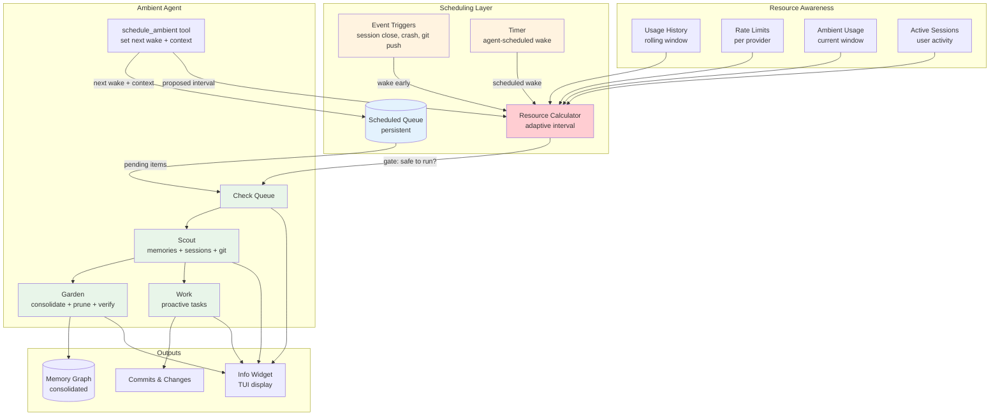
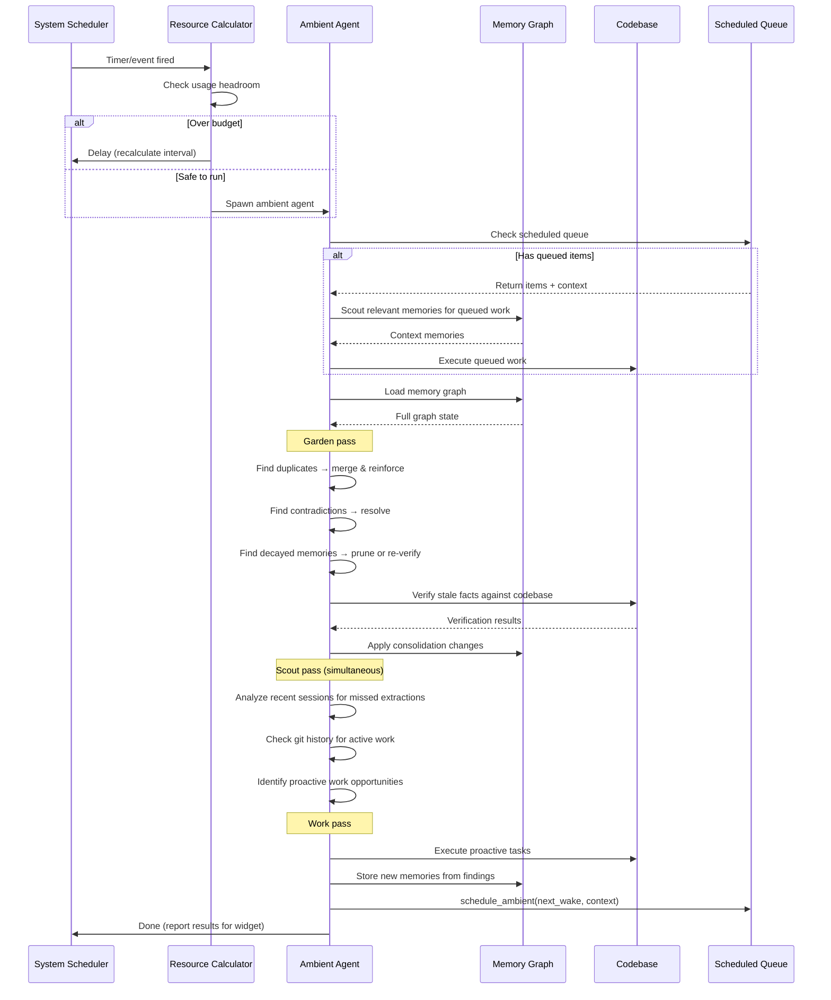
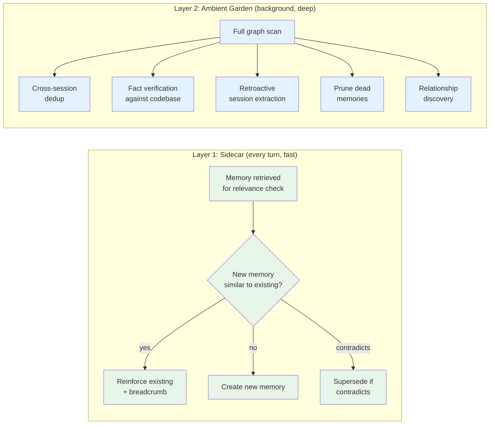
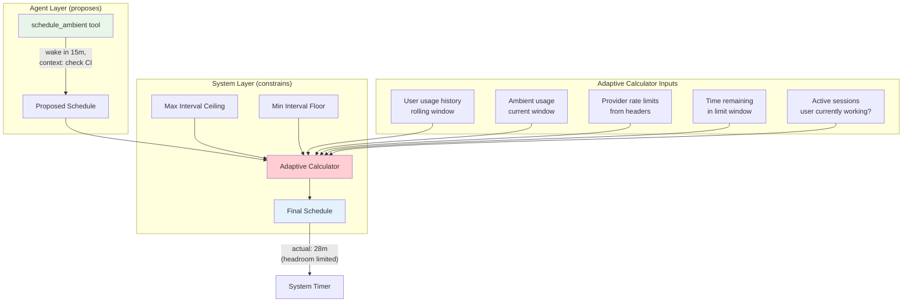
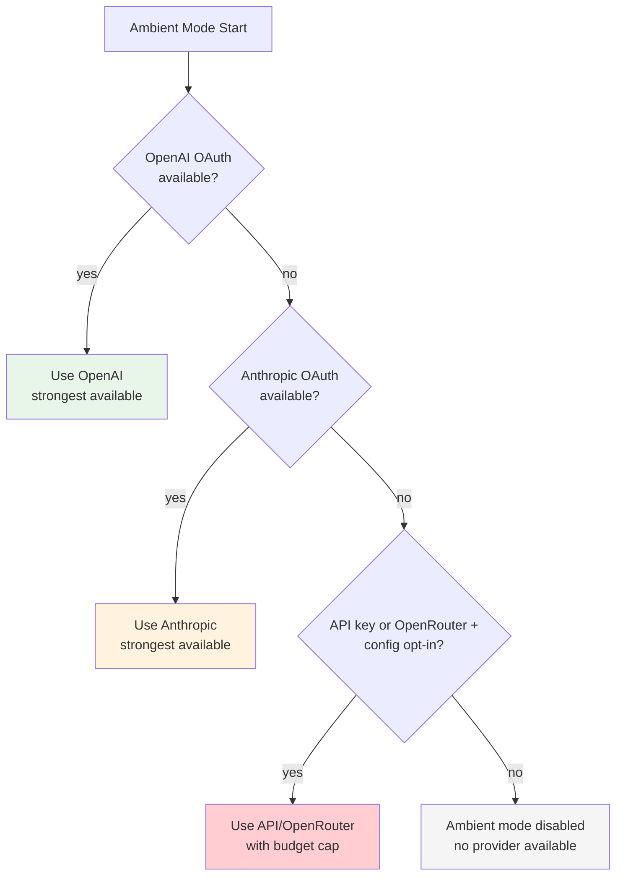
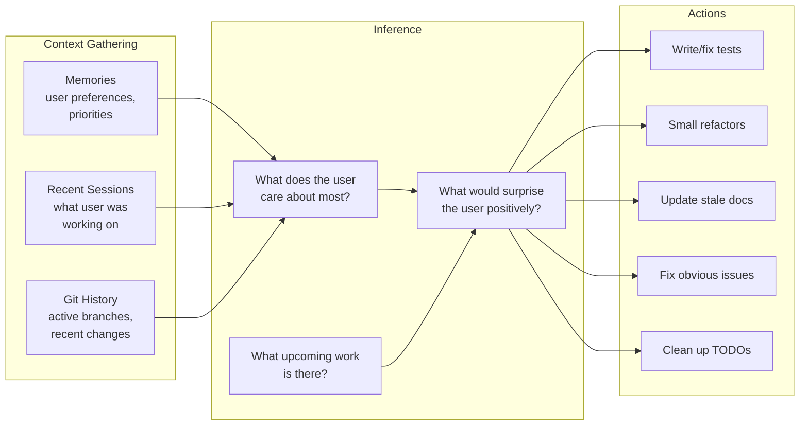

# Ambient Mode

> **Status:** Design
> **Updated:** 2026-02-08

A proactive, always-on agent mode that works autonomously without user prompting. Like a brain consolidating memories during sleep, ambient mode tends to the memory graph, identifies useful work, and acts on the user's behalf — all while staying within resource limits.

## Overview

Ambient mode operates as a background loop that:
1. **Gardens** — consolidates, prunes, and strengthens the memory graph
2. **Scouts** — analyzes recent sessions, git history, and memories to understand what the user cares about
3. **Works** — proactively completes tasks the user would appreciate being surprised by

These aren't separate phases. The agent does all three in a single pass — while looking at memories it naturally discovers maintenance work and identifies proactive opportunities simultaneously.

**Key Design Decisions:**
1. **Single agent at a time** — only one ambient instance ever runs, no parallelism
2. **Subscription-first** — defaults to OAuth (OpenAI/Anthropic), never uses API keys unless explicitly configured
3. **User priority** — interactive sessions always take precedence over ambient work
4. **Strong models** — uses the strongest available model from the selected provider so the agent can reason well about what's actually useful
5. **Self-scheduling** — the agent decides when to wake next, constrained by adaptive resource limits

---

## Architecture



---

## Ambient Cycle

Each ambient cycle follows a single flow. The agent doesn't switch between "modes" — it naturally handles gardening, scouting, and work in one pass.



---

## Memory Consolidation

### Two-Layer Architecture

Memory consolidation happens at two levels, mirroring how the brain encodes during the day and consolidates during sleep.



### Layer 1: Sidecar Consolidation

Runs after every turn, only on memories already retrieved for relevance checking. Zero added latency — runs after results are returned to the main agent.

**Operations:**
- **Duplicate detection** — if the sidecar is about to create a memory that's semantically identical to one it just retrieved, reinforce the existing one instead
- **Contradiction detection** — if a new memory contradicts an existing one in the retrieved set, supersede the old one
- **Reinforcement** — bump strength on memories that keep appearing relevant

**Cost:** Near zero. Only operates on memories already in hand.

### Layer 2: Ambient Garden

Deep consolidation that runs during ambient cycles. Has access to the full memory graph and codebase.

**Operations:**

| Operation | Description | Trigger |
|-----------|-------------|---------|
| **Graph-wide dedup** | Find semantically similar memories across entire graph | Embedding similarity > 0.95 |
| **Contradiction resolution** | Resolve `Contradicts` edges by checking current state | Contradicts edges exist |
| **Fact verification** | Check factual memories against codebase | Facts older than confidence half-life |
| **Retroactive extraction** | Analyze recent sessions that lack memory extraction | Sessions with status Crashed, Closed without extraction |
| **Pruning** | Remove memories with near-zero confidence and low strength | confidence < 0.05 AND strength <= 1 |
| **Relationship discovery** | Find new connections between memories | Co-occurrence in sessions, semantic similarity |
| **Embedding backfill** | Generate embeddings for memories that lack them | embedding is None |
| **Cluster refinement** | Re-run clustering on updated embeddings | Every N ambient cycles |

### Reinforcement Provenance

When a memory is reinforced (by sidecar or ambient), the system records a breadcrumb for traceability:

```rust
pub struct Reinforcement {
    pub session_id: String,
    pub message_index: usize,
    pub timestamp: DateTime<Utc>,
}

pub struct MemoryEntry {
    // ... existing fields ...
    pub reinforcements: Vec<Reinforcement>,
}

impl MemoryEntry {
    pub fn reinforce(&mut self, session_id: &str, message_index: usize) {
        self.strength += 1;
        self.updated_at = Utc::now();
        self.reinforcements.push(Reinforcement {
            session_id: session_id.to_string(),
            message_index,
            timestamp: Utc::now(),
        });
    }
}
```

The consolidation agent can later trace back through reinforcements to understand *why* a memory has the strength it does, and whether those reinforcements still hold.

---

## Scheduling

### Two-Layer Scheduling



### Agent-Initiated Scheduling

The ambient agent has a `schedule_ambient` tool to request its next wake-up:

```rust
// Tool: schedule_ambient
{
    "wake_in_minutes": 15,           // or "wake_at": "2026-02-08T15:30:00Z"
    "context": "Check if CI passed for auth refactor PR",
    "priority": "normal"             // "low" | "normal" | "high"
}
```

The context is stored in the scheduled queue so when the agent wakes up, it knows what it planned to do.

### Adaptive Resource Calculation

The system calculates the safe interval based on usage patterns:

```
headroom = rate_limit - (user_usage_rate + ambient_usage_rate)
safe_interval = max(min_interval, target_budget_fraction / headroom)
```

**Inputs:**
- **User usage rate** — rolling average of tokens/requests per hour from interactive sessions
- **Ambient usage rate** — tokens/requests consumed by ambient in current window
- **Rate limits** — known per-provider limits (from response headers or config)
- **Time in window** — how much of the rate limit window remains
- **Active sessions** — if user is currently in a session, ambient pauses or throttles heavily

**Behavior:**
- Agent says "wake in 10m" but system calculates "not safe until 30m" → pushed to 30m
- Agent says "wake in 6h" but system sees unused budget → pulled forward to max interval
- User starts interactive session → ambient pauses, resumes when user goes idle
- Approaching rate limit → ambient backs off exponentially

### Event Triggers

Certain events can wake ambient early (still subject to resource gate):

| Event | Priority | Rationale |
|-------|----------|-----------|
| Session crashed | High | Likely missed memory extraction |
| Session closed | Normal | May have unextracted memories |
| Git push | Low | Codebase changed, facts may be stale |
| User idle > threshold | Low | Good time for ambient work |
| Explicit `/ambient` command | Immediate | User requested |

### Scheduled Queue

Persistent queue of scheduled ambient tasks:

```rust
pub struct ScheduledItem {
    pub id: String,
    pub scheduled_for: DateTime<Utc>,
    pub context: String,
    pub priority: Priority,
    pub created_by_session: String,     // which ambient cycle created this
    pub created_at: DateTime<Utc>,
}

pub enum Priority {
    Low,
    Normal,
    High,
}
```

**Queue rules:**
- Checked first when ambient wakes up
- Items sorted by priority then scheduled time
- Expired items (past their scheduled_for) are still executed
- System can delay items if over budget, but won't drop them
- Only one ambient agent at a time — if one is running, new triggers queue up

---

## Provider & Model Selection

### Default Priority



**Rationale:**
- **OpenAI first** — separate rate limit pool from Anthropic, so ambient doesn't compete with interactive sessions
- **Anthropic second** — also subscription-based (OAuth), no per-token cost
- **OpenRouter/API keys last** — these are pay-per-token; opt-in only via config to avoid silently burning credits
- **Strong models** — ambient needs good judgment about what work is valuable. A weak model would do the wrong proactive work and annoy the user.

### Model Selection

| Provider | Default Model | Rationale |
|----------|--------------|-----------|
| OpenAI OAuth | Strongest available (e.g. `5.2-codex-xhigh`) | Best reasoning for judgment calls |
| Anthropic OAuth | Strongest available (e.g. `claude-opus-4-6`) | Best available on Anthropic |
| OpenRouter (opt-in) | Strongest available | Pay-per-token, requires config opt-in |
| API key (opt-in) | Configurable | User chooses cost/capability tradeoff |

### Resource Rules

1. **Subscription (OAuth — OpenAI/Anthropic):** Ambient is allowed, subject to adaptive rate limiting
2. **Pay-per-token (API keys, OpenRouter):** Off by default. Enable in config with optional daily budget cap
3. **User active:** Ambient pauses or throttles to minimum when user has an active session
4. **Rate limited:** If ambient hits a rate limit, back off aggressively (exponential backoff)
5. **Separate pools:** Prefer OpenAI for ambient when Anthropic is used interactively (and vice versa)

---

## Proactive Work

### What Ambient Does

The agent uses memories, recent sessions, and git history to identify useful work:



### Safety

Ambient mode operates under the [Safety System](./SAFETY_SYSTEM.md) — a human-in-the-loop layer that classifies actions, requests permission for anything risky, and notifies the user via email/SMS/desktop.

Key constraints for ambient:
- **All actions classified** — auto-allowed (read, local branches, memory ops), requires permission (PRs, pushes, communication), or always denied (force-push, delete remote branches)
- **Commits to a separate branch** — never pushes to main/master directly
- **Code changes require worktree + PR** — modifications always go through review
- **Small, focused changes** — no large refactors without user request
- **Session transcript** — full log of every action, sent as summary after each cycle
- **Respects .gitignore and sensitive files** — same security rules as interactive mode
- **Can be reviewed** — user sees ambient work in the TUI and pending permission requests

---

## Info Widget

The TUI displays ambient mode status alongside existing widgets (memory, tokens, etc.).

### Widget Content

```
╭─ Ambient ─────────────────────────╮
│ ● Running (garden + scout)        │
│ Queue: 2 items (next: check CI)   │
│ Last: 12m ago — pruned 3, merged 1│
│ Next: ~18m (adaptive)             │
│ Budget: ██████░░░░ 58% remaining  │
╰───────────────────────────────────╯
```

**Fields:**

| Field | Description |
|-------|-------------|
| **Status** | `idle` / `running (detail)` / `scheduled` / `paused (rate limited)` |
| **Queue** | Count of scheduled items + preview of next one's context |
| **Last cycle** | Time since last run + summary of what it did |
| **Next wake** | Estimated time until next cycle (from adaptive calculator) |
| **Budget** | Visual bar showing usage: user + ambient + remaining headroom |

### Budget Breakdown

The budget bar shows three segments:

```
User usage     Ambient usage    Remaining
████████████   ████             ░░░░░░░░░░
   45%           12%               43%
```

This gives the user immediate visibility into whether ambient is being too aggressive.

---

## Configuration

```toml
[ambient]
# Enable ambient mode (default: false until stable)
enabled = false

# Provider override (default: auto-select per priority chain)
# provider = "openai"

# Model override (default: provider's strongest)
# model = "5.2-codex-xhigh"

# Allow API key usage (default: false, only OAuth)
allow_api_keys = false

# Daily token budget when using API keys (ignored for OAuth)
# api_daily_budget = 100000

# Minimum interval between cycles in minutes (default: 5)
min_interval_minutes = 5

# Maximum interval between cycles in minutes (default: 120)
max_interval_minutes = 120

# Pause ambient when user has active session (default: true)
pause_on_active_session = true

# Enable proactive work (vs garden-only mode) (default: true)
proactive_work = true

# Proactive work branch prefix (default: "ambient/")
work_branch_prefix = "ambient/"
```

---

## Storage

```
~/.jcode/ambient/
├── state.json              # Current ambient state (status, last run, etc.)
├── queue.json              # Scheduled queue (persistent across restarts)
├── usage.json              # Usage history for adaptive calculation
└── logs/
    └── ambient-YYYY-MM-DD.log  # Daily ambient activity logs
```

---

## Implementation Phases

### Phase 1: Foundation
- [ ] Ambient agent loop (spawn, run, sleep)
- [ ] Single-instance guard
- [ ] Basic scheduling (fixed interval with max ceiling)
- [ ] Provider selection chain (OpenAI → OpenRouter → Anthropic → disabled)
- [ ] Configuration (`[ambient]` section in config)
- [ ] Storage layout

### Phase 2: Memory Consolidation — Sidecar (Layer 1)
- [ ] Duplicate detection in sidecar (on memories already retrieved)
- [ ] Contradiction detection in sidecar
- [ ] Reinforce instead of duplicate
- [ ] Reinforcement provenance (session_id + message_index breadcrumbs)
- [ ] Runs after returning results to main agent (zero latency impact)

### Phase 3: Memory Consolidation — Garden (Layer 2)
- [ ] Full graph-wide dedup scan
- [ ] Fact verification against codebase
- [ ] Retroactive session extraction (crashed/missed sessions)
- [ ] Pruning dead memories (low confidence + low strength)
- [ ] Relationship discovery across sessions
- [ ] Embedding backfill
- [ ] Contradiction resolution

### Phase 4: Scheduling
- [ ] `schedule_ambient` tool for agent self-scheduling
- [ ] Scheduled queue (persistent, with context)
- [ ] Adaptive resource calculator
- [ ] Usage history tracking
- [ ] Rate limit awareness (from provider response headers)
- [ ] Event triggers (session close, crash, git push)
- [ ] Active session detection → pause/throttle

### Phase 5: Proactive Work
- [ ] Scout: analyze recent sessions + git history
- [ ] Infer user priorities from memories
- [ ] Identify actionable work
- [ ] Execute on separate branch
- [ ] Report results

### Phase 6: Info Widget
- [ ] Ambient status display in TUI
- [ ] Queue preview
- [ ] Last cycle summary
- [ ] Next wake estimate
- [ ] Budget bar (user vs ambient vs remaining)

---

*Last updated: 2026-02-08*
