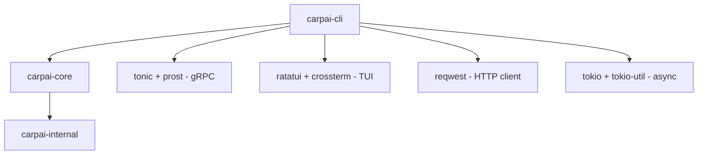

# CarpAI CLI 架构文档

> **Crate**: `carpai-cli`
> **定位**: 面向用户的 TUI 客户端产品 (Layer 2b)
> **依赖**: `carpai-core` (Layer 1) → `carpai-internal` (Layer 0)

## 架构概览

```
用户输入 (终端)
     │
     ▼
┌──────────────────────────────────────────────┐
│               main.rs                         │
│  clap CLI: chat / ask / complete / serve      │
└─────────────────────┬────────────────────────┘
                      │
                      ▼
┌──────────────────────────────────────────────┐
│            cli/ (命令分发层)                   │
│  chat.rs  ask.rs  completion.rs  serve.rs     │
└─────────────────────┬────────────────────────┘
                      │
          ┌──────────┴──────────┐
          ▼                     ▼
┌──────────────────┐  ┌──────────────────────┐
│   tui/ (渲染层)   │  │  agent_bridge.rs      │
│  app.rs          │  │  (桥接层, 零业务逻辑) │
│  handler.rs      │  │                       │
│  widgets/        │  │  LocalMode → core     │
│   chat_view      │  │  RemoteMode → gRPC    │
│   input_bar      │  └──────────┬───────────┘
│   status_line    │             │
│   file_tree      │             ▼
│   help_overlay   │  ┌──────────────────────┐
└──────────────────┘  │  grpc_client.rs       │
                      │  (远程服务器客户端)   │
                      └──────────────────────┘
```

## 模块职责

### 1. 入口层 — `main.rs`
- clap CLI 参数解析
- 命令路由分发 (4 个子命令)
- tracing-subscriber 初始化

### 2. 命令层 — `cli/`
| 文件 | 职责 |
|------|------|
| `chat.rs` | 加载配置 → 构建 AgentContext → 启动 TUI |
| `ask.rs` | 一次性问答, 调用 `execute_agent_turn` |
| `completion.rs` | 代码补全, 优先 CodeCompletion trait, 回退 agent_turn |
| `serve.rs` | 查找 carpai-server 二进制并启动子进程 |

### 3. TUI 渲染层 — `tui/`
**核心设计**: 纯渲染, 零业务逻辑。所有 agent 调用通过 bridge。

| 文件 | 职责 |
|------|------|
| `app.rs` | App 状态 (messages/input/mode) + UI 事件处理 |
| `handler.rs` | 键盘事件分发 |
| `event.rs` | Event 枚举 (Key/Mouse/Resize/Tick) |
| `theme.rs` | 配色方案定义 |
| `mod.rs` | TUI 主循环 (raw mode / draw / event poll) |
| `widgets/chat_view.rs` | 消息列表渲染 |
| `widgets/input_bar.rs` | 输入框渲染 |
| `widgets/status_line.rs` | 状态栏渲染 |
| `widgets/help_overlay.rs` | 帮助覆盖层 |
| `widgets/file_tree.rs` | 文件树面板 (异步递归扫描) |

### 4. 桥接层 — `agent_bridge.rs`
- 双模式路由: Local(核心) / Remote(gRPC)
- 重试机制 (指数退避 + jitter)
- 优雅降级 (错误时返回引导消息而非崩溃)

### 5. 通信层 — `grpc_client.rs`
- gRPC 客户端 (tonic + prost)
- 支持服务: AgentService / SessionService / Health

### 6. 后端基础 — `ambient/`
| 文件 | 职责 |
|------|------|
| `runner.rs` | BackgroundRunner (Semaphore + CancellationToken) |
| `scheduler.rs` | TaskScheduler (interval + select! 周期任务) |

### 7. 通知渠道 — `notifications/`
| 文件 | 职责 |
|------|------|
| `browser.rs` | 跨平台浏览器 URL 打开 |
| `telegram.rs` | Telegram Bot API 通知 |
| `gmail.rs` | Gmail 摘要生成 (SMTP 预留) |

### 8. 工具模块
| 文件 | 职责 |
|------|------|
| `config.rs` | CliConfig + Theme/Keybind/Clipboard/Startup 子配置 |
| `modes.rs` | CliMode 枚举 (Local/Remote) |
| `config_watch.rs` | 配置文件热重载检测 |
| `retry.rs` | 指数退避重试工具 |

## 依赖关系



## 接口契约

### 入口: `execute_agent_turn`
```rust
pub async fn execute_agent_turn(
    ctx: &AgentContext,
    user_message: &str,
) -> Result<AgentTurnOutput>;
```

### 输出: `AgentTurnOutput`
```rust
pub struct AgentTurnOutput {
    pub text: String,
    pub tool_calls: Vec<ToolCallInfo>,
    pub usage: TokenUsage,
    pub session_id: SessionId,
    pub duration_ms: u64,
}
```

## 配置层次

```
Layer 0: AppConfig        (carpai-internal) — 运行模式 + 基础参数
Layer 1: CoreConfig       (carpai-core)     — 存储路径 + 并发 + Provider
Layer 2b: CliConfig       (carpai-cli)      — 主题 + 快捷键 + 远程模式
```

## 测试策略

- **单元测试**: 31 个 (config/modes/retry/bridge/tui/notifications)
- **集成测试**: 28 个 (config/ambient/bridge/notifications/e2e)
- **E2E 测试**: 7 个场景 (基础对话/空输入/重建/热重载/远程)
