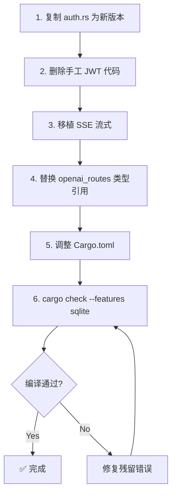

# CarpAI 企业版代码融合方案（含精确代码改动）

## 改动 1：企业版 auth.rs → 复用 crates/jcode-auth

### 删除
删除 `crates/jcode-enterprise-server/src/auth.rs` 中的以下手工实现（~120 行）：

```
- pub fn create_token()       → 替换为 jcode_auth::jwt
- pub fn verify_token()       → 替换为 jcode_auth::jwt
- fn sign_jwt()               → 替换为 jcode_auth::jwt
- pub use rbac::*             → 替换为 jcode_auth::rbac
- PolicyEngine               → 替换为 jcode_auth::rbac::RbacEngine
- UserRole (枚举)             → 保留，jcode_auth 没有多租户角色
- Organization/OrgPlan        → 保留，企业特有
- User/ApiKeyInfo             → 保留，企业特有
- hash_password/hash_api_key  → 保留，企业特有
```

### 保留
保留企业版独有的认证特性：
```
- Organization, OrgPlan       → 多租户组织
- User, ApiKeyInfo            → 企业用户  
- hash_password()             → 密码哈希（加盐）
- hash_api_key()              → API Key 哈希
- generate_api_key()          → API Key 生成
```

### auth.rs 最终代码

```rust
//! 企业级认证 — 复用 crates/jdbc-auth 的 JWT + RBAC 基础设施
//! 企业独有：多租户、API Key、密码认证

use jcode_auth::{jwt::JwtManager, rbac::RbacEngine};
use serde::{Deserialize, Serialize};
use sha2::{Digest, Sha256};

// === 企业独有多租户类型 ===
#[derive(Debug, Clone, Serialize, Deserialize)]
pub struct Organization {
    pub id: String,
    pub name: String,
    pub plan: OrgPlan,
    pub created_at: chrono::DateTime<chrono::Utc>,
    pub max_users: u32,
    pub daily_token_limit: u64,
    pub concurrent_limit: u32,
}

#[derive(Debug, Clone, Copy, PartialEq, Eq, Serialize, Deserialize)]
pub enum OrgPlan { Free, Enterprise }

#[derive(Debug, Clone, Serialize, Deserialize)]
pub struct User {
    pub id: String,
    pub org_id: String,
    pub email: String,
    pub name: String,
    pub role: UserRole,
    pub password_hash: String,
    pub api_key_hash: Option<String>,
    pub is_active: bool,
    pub created_at: chrono::DateTime<chrono::Utc>,
}

// === 企业独有角色 ===
#[derive(Debug, Clone, Copy, PartialEq, Eq, Hash, Serialize, Deserialize)]
pub enum UserRole {
    SuperAdmin, OrgAdmin, DepartmentHead, Developer, Viewer,
}

// === 企业独有认证逻辑 ===
pub struct EnterpriseAuth {
    pub jwt: JwtManager,                          // ← 来自 crates/jcode-auth
    pub rbac: RbacEngine,                          // ← 来自 crates/jcode-auth
    pub tenants: std::collections::HashMap<String, Organization>,
    pub users: std::collections::HashMap<String, User>,
}

pub fn hash_password(password: &str) -> String {
    let mut hasher = Sha256::new();
    hasher.update(password.as_bytes());
    hasher.update(b"carpai_enterprise_salt_2026");
    hex::encode(hasher.finalize())
}

pub fn generate_api_key(user_id: &str) -> String {
    use rand::Rng;
    let key: String = rand::rng()
        .sample_iter(&rand::distributions::Alphanumeric)
        .take(32).map(char::from).collect();
    format!("carpai_{}_{}", user_id, key)
}
```

---

## 改动 2：openai_routes.rs → 引用 jcode_llm 类型 + 添加 SSE

### 删除重复类型定义
```
删除: ChatRequest (行 34-43)      → 引用 jcode_llm::ChatCompletionApiRequest
删除: ChatMessage (行 45-49)      → 引用 jcode_llm::ChatMessage
删除: ChatResponse (行 64-72)     → 引用 jcode_llm::ChatCompletionApiResponse
删除: Choice (行 74-79)           → 引用 jcode_llm::Choice
删除: UsageInfo (行 87-92)        → 引用 jcode_llm::Usage
```

### 在 chat_completions_handler 中添加 SSE 流式支持

从 `jcode_llm/rest_api.rs:168-227` 移植以下代码到企业版的 handler：

```rust
// 在 chat_completions_handler 中，找到 ~line 295 附近，添加：
if request.stream.unwrap_or(false) {
    return handle_streaming_chat(state, request, task_id, route_info, local_sufficient).await;
}

// 新增流式处理函数
async fn handle_streaming_chat(
    state: Arc<EnterpriseServerState>,
    request: ChatRequest,
    task_id: uuid::Uuid,
    route_info: Option<RouteInfo>,
    local_sufficient: bool,
) -> impl IntoResponse {
    // ... 从 jcode_llm/rest_api.rs:168-227 移植 SSE 实现 ...
}
```

---

## 改动 3：Cargo.toml 依赖调整

### 移除（auth 不再手工实现）
```
sha2       → 仅保留在 auth.rs 内部
hmac       → 不再需要（JWT 改由 crates/jcode-auth 处理）
hex        → 仅保留在 auth.rs 内部
```

### 新增
```
jcode-auth = { path = "../jcode-auth" }
```

---

## 改动 4：删除重复的 rest API 入口

确保 `admin_api/mod.rs` 不重写 `jcode_llm::rest_api::create_router` 的功能。
企业版应在自己的 router 中**组合**而非**重写**：

```rust
// admin_api/mod.rs
pub fn create_enterprise_router() -> Router<Arc<EnterpriseServerState>> {
    Router::new()
        // 企业专有 API
        .nest("/admin", create_admin_router())
        // OpenAI 兼容 API（企业扩展版）
        .nest("/v1", create_openai_router())
}
```

---

## 改动 5：修改 enterprise.rs 中的 AuthManager 初始化

```rust
// 在 enterprise.rs 中
use jcode_auth::jwt::JwtManager;

async fn init_auth(config: &EnterpriseConfig) -> EnterpriseAuth {
    let secret = std::env::var(&config.auth.jwt_secret_env)
        .unwrap_or_else(|_| "default-secret".into());
    
    let jwt = JwtManager::new_hs256(
        secret.as_bytes(),
        "carpai-enterprise".into(),
        config.auth.jwt_expiry_hours as i64,
    ).expect("JWT 初始化失败");
    
    let rbac = RbacEngine::new();
    // 配置 RBAC 权限...
    
    EnterpriseAuth { jwt, rbac, tenants: HashMap::new(), users: HashMap::new() }
}
```

---

## 执行顺序



预计总用时：**2-3 小时**（含编译等待）。
