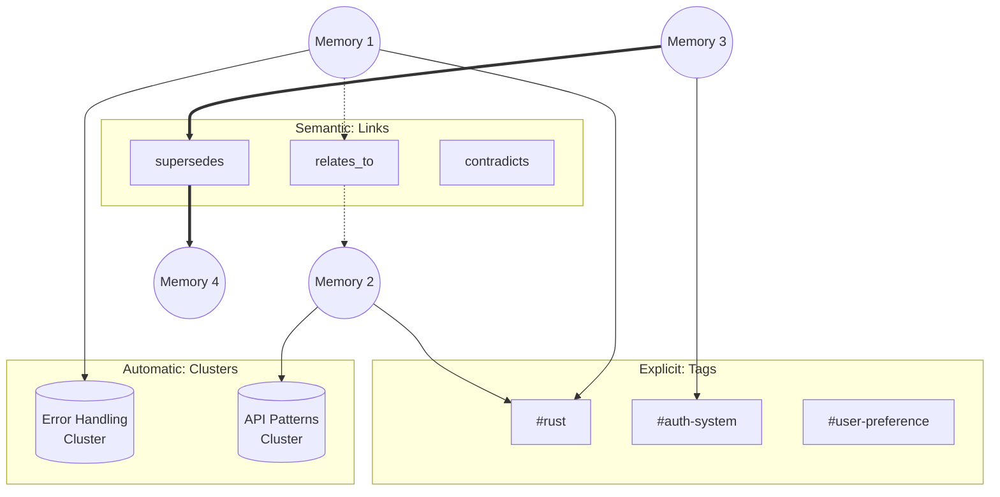

# Memory Architecture Design

> **Status:** Implemented (Core), Planned (Graph-Based Hybrid)
> **Updated:** 2026-01-27

Local embeddings + Haiku sidecar are implemented and running in production. This document describes both the current implementation and the planned graph-based hybrid architecture.

## Overview

A multi-layered memory system for cross-session learning that mimics how human memory works - relevant memories "pop up" when triggered by context rather than requiring explicit recall.

**Key Design Decisions:**
1. **Fully async and non-blocking** - The main agent never waits for memory; results from turn N are available at turn N+1
2. **Graph-based organization** - Memories form a connected graph with tags, clusters, and semantic links
3. **Cascade retrieval** - Embedding hits trigger BFS traversal to find related memories
4. **Hybrid grouping** - Combines explicit tags, automatic clusters, and semantic links

---

## Architecture Overview


---

## Graph-Based Data Model

### Node Types


| Node Type | Description | Storage |
|-----------|-------------|---------|
| **Memory** | Core memory entry (fact, preference, procedure) | Content, metadata, embedding |
| **Tag** | Explicit label (user-defined or inferred) | Name, description, count |
| **Cluster** | Automatic grouping via embedding similarity | Centroid embedding, member count |

### Edge Types

| Edge Type | From → To | Description |
|-----------|-----------|-------------|
| `HasTag` | Memory → Tag | Memory has this explicit tag |
| `InCluster` | Memory → Cluster | Memory belongs to auto-discovered cluster |
| `RelatesTo` | Memory → Memory | Semantic relationship (weighted) |
| `Supersedes` | Memory → Memory | Newer memory replaces older |
| `Contradicts` | Memory → Memory | Conflicting information |
| `DerivedFrom` | Memory → Memory | Procedural knowledge derived from facts |

### Rust Implementation

```rust
use petgraph::graph::DiGraph;

/// Node in the memory graph
#[derive(Debug, Clone)]
pub enum MemoryNode {
    Memory(MemoryEntry),
    Tag(TagEntry),
    Cluster(ClusterEntry),
}

/// Edge relationships
#[derive(Debug, Clone)]
pub enum EdgeKind {
    HasTag,
    InCluster,
    RelatesTo { weight: f32 },
    Supersedes,
    Contradicts,
    DerivedFrom,
}

/// The memory graph
pub struct MemoryGraph {
    graph: DiGraph<MemoryNode, EdgeKind>,
    // Indexes for fast lookup
    memory_index: HashMap<String, NodeIndex>,
    tag_index: HashMap<String, NodeIndex>,
    cluster_index: HashMap<String, NodeIndex>,
}
```

---

## Hybrid Grouping System

The memory system uses three complementary organization methods:



### 1. Tags (Explicit)

User-defined or automatically inferred labels.

**Sources:**
- User explicitly tags: `memory { action: "remember", tags: ["rust", "auth"] }`
- Inferred from context (file paths, topics, entities)
- Extracted by Haiku during end-of-session processing

**Examples:**
- `#project:jcode` - Project-specific
- `#rust`, `#python` - Language-specific
- `#auth`, `#database` - Domain-specific
- `#preference`, `#correction` - Category tags

### 2. Clusters (Automatic)

Automatically discovered groupings based on embedding similarity.

**Algorithm:**
1. Periodically run HDBSCAN on memory embeddings
2. Create/update cluster nodes for dense regions
3. Assign `InCluster` edges to nearby memories
4. Track cluster centroids for fast lookup

**Benefits:**
- Discovers hidden patterns user didn't explicitly tag
- Groups related memories even without shared tags
- Enables "find similar" queries

### 3. Links (Semantic Relationships)

Explicit relationships between memories.

**Types:**
- **RelatesTo**: General semantic connection (weighted 0.0-1.0)
- **Supersedes**: Newer information replaces older
- **Contradicts**: Conflicting information (both kept, flagged)
- **DerivedFrom**: Procedural knowledge derived from facts

**Discovery:**
- Contradiction detection on write
- Haiku sidecar identifies relationships during verification
- User can explicitly link memories

---

## Cascade Retrieval

When context triggers memory search, cascade retrieval finds related memories through graph traversal.

```mermaid
sequenceDiagram
    participant C as Context
    participant E as Embedder
    participant S as Similarity Search
    participant G as Graph BFS
    participant H as Haiku Sidecar
    participant R as Results

    C->>E: Current context
    E->>S: Context embedding
    S->>S: Find top-k similar memories
    S->>G: Initial hits (seed nodes)

    loop BFS Traversal (depth ≤ 2)
        G->>G: Follow HasTag edges → find co-tagged memories
        G->>G: Follow InCluster edges → find cluster siblings
        G->>G: Follow RelatesTo edges → find linked memories
    end

    G->>H: Candidate memories
    H->>H: Verify relevance to context
    H->>R: Filtered, ranked memories
```



### Algorithm

```rust
pub fn cascade_retrieve(
    &self,
    context_embedding: &[f32],
    max_depth: usize,
    max_results: usize,
) -> Vec<(MemoryEntry, f32)> {
    // Step 1: Embedding similarity search
    let initial_hits = self.similarity_search(context_embedding, 10);

    // Step 2: BFS traversal from hits
    let mut visited: HashSet<NodeIndex> = HashSet::new();
    let mut candidates: Vec<(NodeIndex, f32, usize)> = Vec::new();
    let mut queue: VecDeque<(NodeIndex, usize)> = VecDeque::new();

    for (node, score) in initial_hits {
        queue.push_back((node, 0));
        candidates.push((node, score, 0));
    }

    while let Some((node, depth)) = queue.pop_front() {
        if depth >= max_depth || visited.contains(&node) {
            continue;
        }
        visited.insert(node);

        // Traverse edges
        for edge in self.graph.edges(node) {
            let neighbor = edge.target();
            if visited.contains(&neighbor) {
                continue;
            }

            let edge_weight = match edge.weight() {
                EdgeKind::HasTag => 0.8,        // Strong signal
                EdgeKind::InCluster => 0.6,     // Medium signal
                EdgeKind::RelatesTo { weight } => *weight,
                EdgeKind::Supersedes => 0.9,    // Very relevant
                _ => 0.3,
            };

            // Decay score by depth
            let decayed_score = edge_weight * (0.7_f32).powi(depth as i32 + 1);

            if let MemoryNode::Memory(_) = &self.graph[neighbor] {
                candidates.push((neighbor, decayed_score, depth + 1));
            }

            queue.push_back((neighbor, depth + 1));
        }
    }

    // Step 3: Dedupe, sort, and return top results
    candidates.sort_by(|a, b| b.1.partial_cmp(&a.1).unwrap());
    candidates.into_iter()
        .filter_map(|(node, score, _)| {
            if let MemoryNode::Memory(entry) = &self.graph[node] {
                Some((entry.clone(), score))
            } else {
                None
            }
        })
        .take(max_results)
        .collect()
}
```

### Retrieval Parameters

| Parameter | Default | Description |
|-----------|---------|-------------|
| `similarity_threshold` | 0.4 | Minimum embedding similarity for initial hits |
| `max_initial_hits` | 10 | Number of embedding search results |
| `max_depth` | 2 | BFS traversal depth limit |
| `max_results` | 10 | Final results to return |
| `edge_decay` | 0.7 | Score decay per traversal step |

---

## Memory Entry Schema

```rust
#[derive(Debug, Clone, Serialize, Deserialize)]
pub struct MemoryEntry {
    // Identity
    pub id: String,
    pub content: String,
    pub category: MemoryCategory,

    // Classification
    pub memory_type: MemoryType,  // Fact, Preference, Procedure, Correction
    pub scope: MemoryScope,       // Global, Project, Session

    // Source tracking
    pub session_id: Option<String>,
    pub message_range: Option<(u32, u32)>,
    pub file_paths: Vec<String>,
    pub provenance: Provenance,   // UserStated, Observed, Inferred

    // Lifecycle
    pub created_at: DateTime<Utc>,
    pub updated_at: DateTime<Utc>,
    pub last_accessed: DateTime<Utc>,
    pub access_count: u32,
    pub strength: u32,            // Consolidation count

    // Trust & status
    pub confidence: f32,          // 0.0-1.0, decays over time
    pub trust_score: f32,         // Source-based trust
    pub active: bool,
    pub superseded_by: Option<String>,

    // Embedding
    pub embedding: Option<Vec<f32>>,
}

#[derive(Debug, Clone, Serialize, Deserialize)]
pub enum MemoryType {
    Fact,        // "This project uses PostgreSQL"
    Preference,  // "User prefers 4-space indentation"
    Procedure,   // "To deploy: run make deploy"
    Correction,  // "Don't use deprecated API"
    Negative,    // "Never commit .env files"
}

#[derive(Debug, Clone, Serialize, Deserialize)]
pub enum Provenance {
    UserStated,     // User explicitly said it
    UserCorrected,  // User corrected agent behavior
    Observed,       // Agent observed from behavior
    Inferred,       // Agent inferred from context
    Extracted,      // Extracted from session summary
}
```

---

## Advanced Features

### 1. Temporal Awareness

Memories have temporal context:

```rust
pub struct TemporalContext {
    pub session_scope: bool,      // Only relevant in session
    pub recency_weight: f32,      // Recent access boost
    pub seasonal: Option<String>, // "end-of-sprint", "release-week"
}
```

**Recency boost formula:**
```
boost = 1.0 + (0.5 * e^(-hours_since_access / 24))
```

### 2. Confidence Decay

Confidence decays over time based on memory type:

| Memory Type | Half-life | Rationale |
|-------------|-----------|-----------|
| Correction | 365 days | User corrections are high value |
| Preference | 90 days | Preferences may evolve |
| Fact | 30 days | Codebase facts can become stale |
| Procedure | 60 days | Procedures change less often |
| Inferred | 7 days | Low-confidence inferences |

**Decay formula:**
```
confidence = initial_confidence * e^(-age_days / half_life)
           * (1 + 0.1 * log(access_count + 1))
           * trust_weight
```

### 3. Negative Memories

Things the agent should avoid doing:

```rust
MemoryEntry {
    content: "Never use println! for logging in production code",
    memory_type: MemoryType::Negative,
    trigger_patterns: vec!["println!", "print!", "dbg!"],
    ...
}
```

**Surfacing:** Negative memories are surfaced when trigger patterns match current context.

### 4. Procedural Memories

How-to knowledge with structured steps:

```rust
pub struct Procedure {
    pub name: String,
    pub trigger: String,        // "deploy to production"
    pub steps: Vec<String>,
    pub prerequisites: Vec<String>,
    pub warnings: Vec<String>,
}
```

### 5. Provenance Tracking

Every memory tracks its source:

```rust
pub struct ProvenanceChain {
    pub source: Provenance,
    pub session_id: String,
    pub timestamp: DateTime<Utc>,
    pub context_snippet: String,  // What was being discussed
    pub confidence_reason: String, // Why this confidence level
}
```

### 6. Feedback Loops

Memories strengthen or weaken based on use:

```rust
impl MemoryEntry {
    pub fn on_used(&mut self, helpful: bool) {
        self.access_count += 1;
        self.last_accessed = Utc::now();

        if helpful {
            self.strength = self.strength.saturating_add(1);
            self.confidence = (self.confidence + 0.05).min(1.0);
        } else {
            self.confidence = (self.confidence - 0.1).max(0.0);
        }
    }
}
```

### 7. Scope Levels

Memories exist at different scopes:


| Scope | Lifetime | Examples |
|-------|----------|----------|
| Global | Permanent | "User prefers vim keybindings" |
| Project | Until deleted | "This project uses async/await" |
| Session | Current session | "Working on auth refactor" |

---

## Async Processing Pipeline

```
┌─────────────────────────────────────────────────────────────────────────────┐
│                           MEMORY AGENT ARCHITECTURE                         │
└─────────────────────────────────────────────────────────────────────────────┘

┌─────────────────────┐                              ┌─────────────────────────┐
│     MAIN AGENT      │                              │     MEMORY AGENT        │
│     (TUI App)       │                              │   (Background Task)     │
├─────────────────────┤                              ├─────────────────────────┤
│                     │      mpsc channel            │                         │
│  build_memory_      │  ┌─────────────────────┐     │  Persistent State:      │
│  prompt_nonblocking │  │   ContextUpdate     │     │  ├─ last_context_emb    │
│         │           │  │   {messages, ts}    │     │  ├─ surfaced_memories   │
│         ▼           │  └─────────────────────┘     │  └─ turn_count          │
│  ┌──────────────┐   │            │                 │                         │
│  │ take_pending │   │            │ try_send()      │                         │
│  │ _memory()    │◄──┼────────────┼─────────────────┼──┐                      │
│  └──────────────┘   │            │ (non-blocking)  │  │                      │
│         │           │            ▼                 │  │                      │
│         │           │  ┌─────────────────────┐     │  │                      │
│         ▼           │  │  update_context_    │     │  │  set_pending_        │
│  Return to LLM      │  │  sync()             │─────┼──┼─►memory()            │
│  system prompt      │  └─────────────────────┘     │  │                      │
│                     │                              │  │                      │
└─────────────────────┘                              │  │                      │
                                                     │  │                      │
                         ┌───────────────────────────┼──┘                      │
                         │                           │                         │
                         ▼                           │                         │
              ┌──────────────────────┐               │                         │
              │   PROCESSING LOOP    │               │                         │
              └──────────────────────┘               │                         │
                         │                           │                         │
         ┌───────────────┼───────────────┐           │                         │
         ▼               ▼               ▼           │                         │
┌─────────────┐  ┌─────────────┐  ┌─────────────┐    │                         │
│  1. EMBED   │  │ 2. CASCADE  │  │ 3. SIDECAR  │    │                         │
│   CONTEXT   │  │  RETRIEVE   │  │   CHECK     │    │                         │
├─────────────┤  ├─────────────┤  ├─────────────┤    │                         │
│ all-MiniLM  │  │ similarity  │  │ Haiku LLM   │    │                         │
│ -L6-v2      │  │ + BFS graph │  │ relevance   │    │                         │
│ (local)     │  │ traversal   │  │ check       │    │                         │
│ ~30ms       │  │             │  │             │    │                         │
└─────────────┘  └─────────────┘  └─────────────┘    │                         │
         │               │               │           │                         │
         └───────────────┴───────────────┘           │                         │
                         │                           │                         │
                         ▼                           │                         │
              ┌──────────────────────┐               │                         │
              │  TOPIC CHANGE        │               │                         │
              │  DETECTION           │               │                         │
              ├──────────────────────┤               │                         │
              │ Compare embedding    │               │                         │
              │ to last_context_emb  │               │                         │
              │ If sim < 0.3:        │               │                         │
              │   clear surfaced set │               │                         │
              └──────────────────────┘               │                         │
                         │                           │                         │
                         ▼                           │                         │
              ┌──────────────────────┐               │                         │
              │  FILTER & STORE      │───────────────┘                         │
              ├──────────────────────┤                                         │
              │ Skip already         │                                         │
              │ surfaced memories    │                                         │
              │ Store in             │                                         │
              │ PENDING_MEMORY       │                                         │
              └──────────────────────┘                                         │
                                                                               │
└──────────────────────────────────────────────────────────────────────────────┘
```

**Key Points:**
- Memory agent is a **singleton** (OnceCell) - only one instance ever runs
- Communication is **non-blocking** via `try_send()` on mpsc channel
- Results arrive **one turn behind** (processed in background)
- **Topic change detection** resets surfaced set when conversation shifts
- **Cascade retrieval** traverses graph for related memories

---

## Storage Layout

```
~/.jcode/memory/
├── graph.json                    # Serialized petgraph
├── projects/
│   └── <project_hash>.json       # Per-directory memories
├── global.json                   # User-wide memories
├── embeddings/
│   └── <memory_id>.vec           # Embedding vectors
├── clusters/
│   └── cluster_metadata.json     # Cluster centroids and metadata
└── tags/
    └── tag_index.json            # Tag → memory mappings
```

---

## Memory Tools

Available to the main agent:

```
memory { action: "remember", content: "...", category: "fact|preference|correction",
         scope: "project|global", tags: ["tag1", "tag2"] }
memory { action: "recall" }                    # Get relevant memories for context
memory { action: "search", query: "..." }      # Semantic search
memory { action: "list", tag: "..." }          # List by tag
memory { action: "forget", id: "..." }         # Deactivate memory
memory { action: "link", from: "id1", to: "id2", relation: "relates_to" }
memory { action: "tag", id: "...", tags: ["new", "tags"] }
```

---

## Implementation Status

### Phase 1: Basic Memory Tools ✅
- [x] Memory store with file persistence
- [x] Basic memory tool
- [x] Integration with agent

### Phase 2: Embedding Search ✅
- [x] Local all-MiniLM-L6-v2 via tract-onnx
- [x] Background embedding process
- [x] Similarity search with cosine distance

### Phase 3: Memory Agent ✅
- [x] Async channel communication
- [x] Haiku sidecar for relevance verification
- [x] Topic change detection
- [x] Surfaced memory tracking

### Phase 4: Graph-Based Architecture 🚧
- [ ] Migrate to petgraph data structure
- [ ] Tag nodes and HasTag edges
- [ ] Cluster discovery and InCluster edges
- [ ] Semantic link edges (RelatesTo, Supersedes, Contradicts)
- [ ] Cascade retrieval algorithm

### Phase 5: Advanced Features 📋
- [ ] Confidence decay system
- [ ] Negative memories and trigger patterns
- [ ] Procedural memory support
- [ ] Provenance tracking
- [ ] Feedback loops (strengthen/weaken)
- [ ] Temporal awareness

### Phase 6: Full Integration 📋
- [ ] End-of-session extraction
- [ ] Consolidation on write
- [ ] User control UI/CLI
- [ ] Memory export/import

---

## Privacy & Security

### Do Not Remember
- API keys, secrets, credentials
- Passwords or tokens
- Personal identifying information
- File contents marked sensitive

### Filtering
Before storing any memory, scan for:
- Regex patterns for secrets (API keys, passwords)
- Files in `.gitignore` or `.secretsignore`
- Content from `.env` files

### User Control
- All memories stored in human-readable JSON
- CLI for viewing/editing/deleting
- Option to disable memory entirely
- Export/import for backup

---

## Open Questions

1. **Multi-machine sync:** Should memories sync across devices via encrypted backup?
2. **Team sharing:** Should some memories be shareable across a team?
3. **Cluster algorithm:** HDBSCAN vs k-means vs hierarchical clustering?
4. **Graph persistence:** JSON serialization vs SQLite for larger graphs?

---

*Last updated: 2026-01-27*
