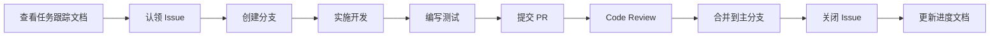

# CarpAI 优化项目 - 团队使用指南

本文档说明如何使用 CarpAI 优化项目的跟踪系统和协作流程。

---

## 📋 快速开始

### 1. 查看优化路线图

首先阅读完整的优化路线图了解整体规划：
- **[优化路线图](carpai-optimization-roadmap.md)** - 详细的实施计划、优先级评估和资源需求

### 2. 查看任务跟踪

查看所有 Epic 和子任务的当前状态：
- **[任务跟踪文档](OPTIMIZATION_TRACKING.md)** - 包含 9 个 Epic 和 82 个子任务的详细列表

### 3. 认领任务

1. 在 [OPTIMIZATION_TRACKING.md](OPTIMIZATION_TRACKING.md) 中找到感兴趣的任务
2. 在 GitHub Issues 中筛选对应标签（如 `priority: P0`, `component: auth`）
3. 在 Issue 中评论表示认领，或直接在 GitHub 上 Assign 自己
4. 更新任务状态为 "进行中"

---

## 🏷️ 标签系统

### 类型标签 (type)
- `type: epic` - 史诗级大型任务
- `type: task` - 具体实施任务
- `type: test` - 测试相关
- `type: docs` - 文档相关
- `type: refactor` - 代码重构
- `type: feature` - 新功能开发
- `type: perf` - 性能优化
- `type: ci` - CI/CD 相关
- `type: design` - 设计阶段
- `type: research` - 技术调研

### 优先级标签 (priority)
- `priority: P0` - 立即执行（阻塞生产使用）
- `priority: P1` - 短期优先（1-2 个月）
- `priority: P2` - 中期规划（3-6 个月）
- `priority: P3` - 长期愿景（6+ 个月）

### 组件标签 (component)
- `component: auth` - 认证授权
- `component: collaboration` - 协作编辑
- `component: crdt` - CRDT/OT 算法
- `component: server` - 服务器核心
- `component: tui` - TUI 界面
- `component: testing` - 测试基础设施
- `component: aer` - 自动错误修复
- `component: distributed` - 分布式集群
- `component: sso` - SSO/LDAP
- `component: quality` - 代码质量
- `component: provider` - LLM Provider
- `component: session` - 会话管理
- `component: tool` - 工具系统
- `component: gdpr` - GDPR 合规
- `component: audit` - 审计日志

### 状态标签 (status)
- `status: todo` - 待办
- `status: in-progress` - 进行中
- `status: review` - 审查中
- `status: done` - 已完成

---

## 🔄 工作流程

### 开发者工作流



### 详细步骤

#### 1. 认领任务
```bash
# 在 GitHub 上：
# 1. 筛选 Issue: is:issue is:open label:"priority: P0" label:"component: auth"
# 2. 点击感兴趣的 Issue
# 3. 点击 "Assign yourself" 或评论 "/assign @your_username"
```

#### 2. 创建开发分支
```bash
git checkout main
git pull origin main
git checkout -b feature/TASK-001-auth-middleware
```

#### 3. 开发与测试
```bash
# 编码...
# 运行测试
cargo test --package jcode-enterprise-server

# 运行 clippy
cargo clippy --all-targets --all-features -- -D warnings

# 格式化代码
cargo fmt --all
```

#### 4. 提交 PR
```bash
git add .
git commit -m "feat(auth): implement EnterpriseAuthMiddleware

- Create JWT validation middleware
- Integrate with jcode-auth JwtManager
- Add unit tests for token validation

Closes #TASK-002"

git push origin feature/TASK-001-auth-middleware

# 然后在 GitHub 上创建 Pull Request
```

#### 5. Code Review
- 至少需要 1 人 Review
- 所有 CI 检查必须通过
- 解决所有 Review 意见

#### 6. 合并与清理
```bash
# PR 合并后
git checkout main
git pull origin main
git branch -d feature/TASK-001-auth-middleware
```

#### 7. 更新进度
- 在 [OPTIMIZATION_TRACKING.md](OPTIMIZATION_TRACKING.md) 中勾选完成的任务
- 更新 Epic 的进度表格
- 在 Issue 中添加完成日期和 PR 链接

---

## 📊 进度报告

### 每周进度更新

每周五下班前，各负责人需要：

1. **更新 Issue 状态**
   - 将完成的 Issue 标记为 Closed
   - 更新进行中的 Issue 进度

2. **更新跟踪文档**
   - 在 [OPTIMIZATION_TRACKING.md](OPTIMIZATION_TRACKING.md) 中更新完成度
   - 添加本周完成的任务列表

3. **提交周报**
   ```markdown
   ## Week X Progress Report

   ### Completed
   - TASK-XXX: [标题] - PR #XXX
   - TASK-XXX: [标题] - PR #XXX

   ### In Progress
   - TASK-XXX: [标题] - 预计下周完成
   - TASK-XXX: [标题] - 遇到 XXX 问题，正在解决

   ### Blockers
   - [如有阻塞问题，在此说明]

   ### Next Week Plan
   - 开始 TASK-XXX
   - 完成 TASK-XXX
   ```

### 每月回顾

每月底召开优化项目回顾会议：

1. **回顾本月目标完成情况**
2. **分析未完成原因**
3. **调整下月计划**
4. **分享技术经验和最佳实践**

---

## 🛠️ 工具使用

### GitHub CLI 批量创建 Issues

如果已安装 GitHub CLI (`gh`)，可以使用提供的脚本批量创建 Issues：

```bash
# 1. 确保 gh 已登录
gh auth login

# 2. 运行脚本
chmod +x scripts/create_optimization_issues.sh
./scripts/create_optimization_issues.sh

# 3. 检查创建的 Issues
gh issue list --repo 1jehuang/jcode --label "type: epic"
```

### 本地跟踪

如果不使用 GitHub Issues，可以仅在本地维护进度：

```bash
# 编辑跟踪文档
code docs/OPTIMIZATION_TRACKING.md

# 使用 git 追踪变更
git add docs/OPTIMIZATION_TRACKING.md
git commit -m "docs: update optimization tracking progress"
```

---

## 🎯 关键里程碑

### Phase 1: 企业功能激活（第 1-4 周）
- **Week 4 结束**: EPIC-001 完成
- **验收**: 所有认证请求经过 jcode-auth，RBAC 覆盖 100% API

### Phase 2: 协作编辑补齐（第 5-12 周）
- **Week 8 结束**: EPIC-002 完成
- **Week 12 结束**: EPIC-003 完成
- **验收**: 多用户可同时编辑，光标同步延迟 < 100ms

### Phase 3: 代码质量提升（第 13-20 周）
- **Week 20 结束**: EPIC-004, EPIC-005, EPIC-006 完成
- **验收**: 测试覆盖率 ≥ 70%，平均文件大小 < 800 LOC

### Phase 4: 高级功能（第 21-32 周）
- **Week 32 结束**: EPIC-007, EPIC-008, EPIC-009 完成
- **验收**: AER 准确率 > 85%，集群故障恢复 < 30s

---

## 📞 沟通渠道

### 日常沟通
- **GitHub Issues**: 技术讨论、进度更新
- **Pull Requests**: Code Review、技术方案讨论
- **Discord/Slack**: 即时沟通（如有）

### 定期会议
- **每日站会** (可选): 15 分钟，同步进展和阻塞问题
- **每周例会**: 1 小时，回顾本周进度，规划下周任务
- **每月回顾**: 2 小时，深度分析和计划调整

### 紧急问题
- 发现严重 bug 或阻塞问题时，立即在 GitHub 创建 Issue 并标记 `priority: P0`
- 在团队沟通渠道中 @相关负责人

---

## 📚 相关文档

- **[优化路线图](carpai-optimization-roadmap.md)** - 完整实施计划
- **[任务跟踪](OPTIMIZATION_TRACKING.md)** - Epic 和子任务列表
- **[代码质量待办](CODE_QUALITY_TODO.md)** - 代码质量提升任务
- **[企业认证指南](ENTERPRISE_AUTH_SETUP.md)** - jcode-auth 集成文档
- **[贡献指南](CONTRIBUTING.md)** - 通用贡献流程

---

## ❓ 常见问题

### Q: 如何选择合适的任务？
A: 根据自己的技能专长和兴趣选择。后端工程师优先 Auth、CRDT、Distributed；前端工程师优先 TUI UI；SRE 优先 CI/CD、Testing。

### Q: 任务预估工作量不准怎么办？
A: 这是正常的。实际实施时记录真实耗时，用于后续任务估算参考。如果偏差超过 50%，在 Issue 中说明原因。

### Q: 遇到技术难题卡住了怎么办？
A: 
1. 先在 Issue 中描述问题和尝试过的解决方案
2. 在团队沟通渠道中寻求帮助
3. 如果 2 天内无进展，考虑调整方案或寻求外部资源

### Q: 可以同时认领多个任务吗？
A: 建议一次只专注于 1-2 个任务，确保质量。完成后再认领新任务。

### Q: 如何申请增加人手或调整优先级？
A: 在每周例会上提出，或在对应的 Epic Issue 中评论说明理由。

---

## 🎉 激励机制

### 贡献认可
- 每月公布贡献排行榜（基于完成任务数和代码质量）
- 优秀 PR 会在团队会议中表彰
- 累计贡献达到一定标准可获得奖励

### 技能成长
- 参与不同组件开发可拓宽技术栈
- Code Review 过程是学习他人优秀代码的好机会
- 技术调研任务可深入了解前沿技术

---

**最后更新**: 2026-05-21

**维护者**: CarpAI Core Team
