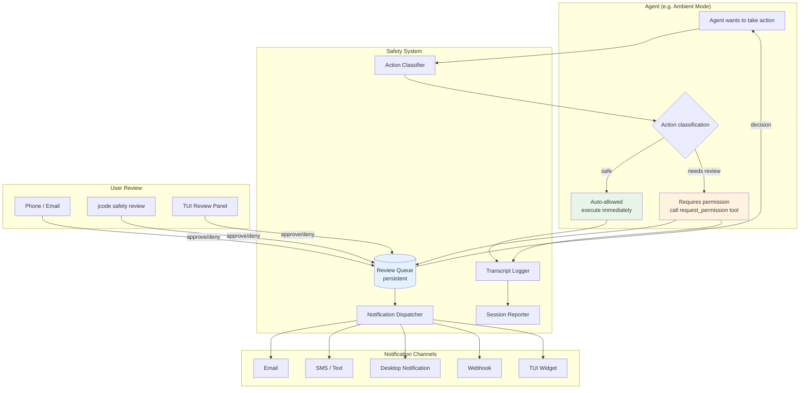
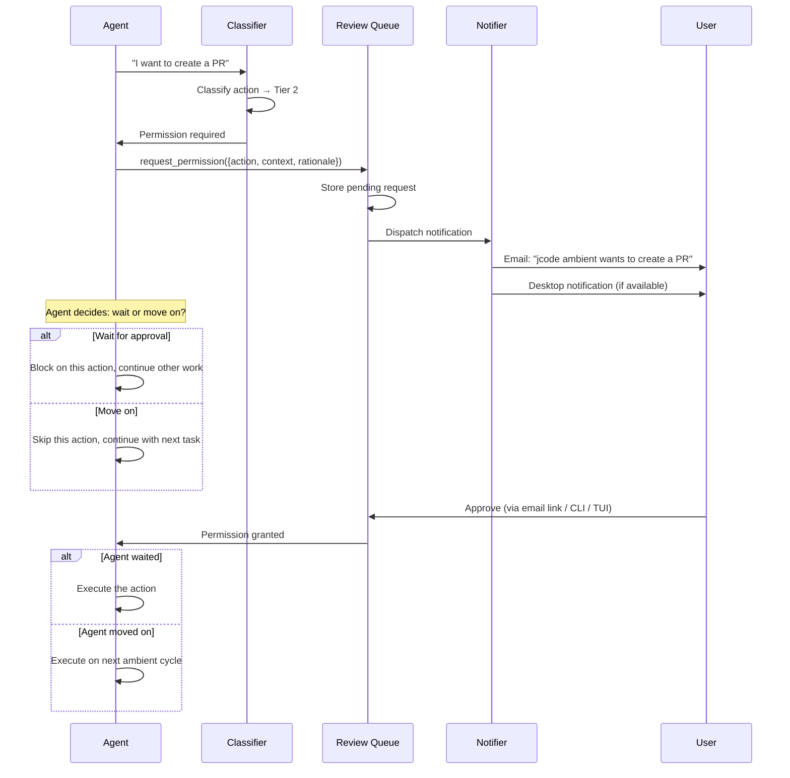
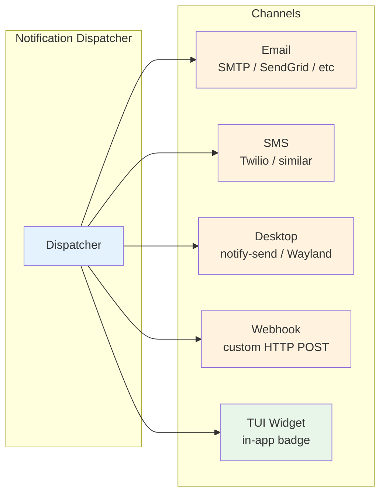

# Safety System

> **Status:** Design
> **Updated:** 2026-02-08

A human-in-the-loop safety layer for unmonitored agent operations. Designed as an independent subsystem that any jcode feature can integrate with. Currently the only consumer is ambient mode, but the system is intentionally decoupled so it can be reused for future features.

## Overview

When an agent operates without direct user supervision (e.g. ambient mode), it needs a way to:
1. **Know what it's allowed to do** without asking
2. **Request permission** for actions that require human approval
3. **Notify the user** that a request is pending
4. **Wait or move on** while the user reviews
5. **Report what it did** after each session

The safety system provides all of this. There are only two tiers: auto-allowed and requires-permission. There is no "always denied" — if the user explicitly approves something, the agent can do it. The core principle is that **anything that communicates with another human or leaves a trace outside the local sandbox requires permission.**

---

## Architecture



---

## Action Classification

Every action an agent wants to take is classified into one of two tiers. There is no "always denied" tier — if the user approves it, the agent can do it. The safety system's job is to make sure the user is asked, not to prevent actions entirely.

### Tier 1: Auto-Allowed (no permission needed)

Actions that are local, reversible, and don't affect anything outside the project sandbox.

| Action | Rationale |
|--------|-----------|
| Read files in project | Read-only, no side effects |
| Read git history / status | Read-only |
| Run tests (read-only) | Verification, no mutations |
| Memory operations (within per-cycle caps) | Local data, reversible |
| Create local branches / git worktrees | Local only, easily deleted |
| Write to ambient's own log/state files | Internal bookkeeping |
| Embed / similarity search | Computation only |
| Analyze sessions for extraction | Read-only analysis |

### Tier 2: Requires Permission (ask user)

Actions that leave a trace outside the local sandbox, affect shared state, or can't be easily undone. **The general rule: anything that communicates directly with another human always requires permission — no exceptions.**

| Action | Rationale |
|--------|-----------|
| **Communication with humans (always Tier 2)** | |
| Send emails | Irreversible, visible to others |
| Submit assignments | Academic consequences |
| Post to Slack / Discord / chat | Visible to others |
| Create GitHub issues / PR comments | Publicly visible |
| Any form of direct human communication | Cannot be unsent |
| **Code modifications** | |
| Modify code in a repo (must use worktree + PR) | Requires review before merge |
| Push to remote | Visible to collaborators |
| Create pull requests | Visible to collaborators |
| Modify CI/CD pipelines | Affects shared infrastructure |
| **System changes** | |
| Install system packages | Modifies system state |
| Modify dotfiles / system config | Affects other tools |
| Start network services / open ports | Security implications |
| **Deployment** | |
| Deploy to any environment | Affects users/services |
| **Data** | |
| Delete files outside project sandbox | May not be recoverable |
| Drop databases / clear non-trivial caches | Data loss risk |
| **Financial / Account** | |
| Purchases / billing changes | Financial consequences |
| Change passwords / API keys / auth | Security consequences |
| Revoke tokens / modify permissions | Access consequences |

### Custom Rules

Users can configure custom classification rules to promote or demote actions:

```toml
[safety.rules]
# Promote: allow ambient to create PRs without asking
allow_without_permission = ["create_pull_request"]

# Demote: always ask before running any tests (e.g. expensive integration tests)
require_permission = ["run_tests"]

# Override: allow push to specific remotes
allow_push_to = ["origin"]
```

---

## Permission Request Flow



### The `request_permission` Tool

Available to any agent operating under the safety system:

```rust
// Tool: request_permission
{
    "action": "create_pull_request",
    "description": "Create PR for ambient/fix-auth-tests branch with 3 test fixes",
    "rationale": "Found 3 failing tests in auth module. Fixed them on a worktree branch.",
    "urgency": "low",           // "low" | "normal" | "high"
    "wait": false               // should the agent block until approved?
}
```

**Response:**
```rust
// If wait=true and user responds:
{ "approved": true, "message": "looks good" }

// If wait=true and timeout:
{ "approved": false, "reason": "timeout", "timeout_minutes": 60 }

// If wait=false:
{ "queued": true, "request_id": "req_abc123" }
```

### Agent Behavior While Waiting

When the agent requests permission with `wait: true`:
- It doesn't block the entire cycle — it moves on to other ambient tasks
- When the user approves, the action is queued for the next cycle (or current cycle if still running)
- If the user doesn't respond within a configurable timeout, the request expires and is logged

When the agent requests permission with `wait: false`:
- The request is queued for user review
- The agent continues without the action
- If approved later, it's picked up on the next ambient cycle

---

## Notification System

### Channels



**Channel priority:** Users configure which channels to use and in what order. Notifications are sent to all enabled channels simultaneously.

**Notification content:**
- What the agent wants to do (action + description)
- Why it wants to do it (rationale)
- How to approve/deny (link or instructions)
- Urgency level

### Configuration

```toml
[safety.notifications]
# Enable/disable channels
email = true
sms = false
desktop = true
webhook = false

# Email settings
[safety.notifications.email]
to = "jeremy@example.com"
# Provider: "smtp", "sendgrid", "ses"
provider = "smtp"
smtp_host = "smtp.gmail.com"
smtp_port = 587

# SMS settings (if enabled)
[safety.notifications.sms]
to = "+1234567890"
provider = "twilio"

# Webhook (if enabled)
[safety.notifications.webhook]
url = "https://example.com/jcode-safety"
secret = "..."

# Desktop notification (uses notify-send or similar)
[safety.notifications.desktop]
enabled = true

# Notification preferences
[safety.notifications.preferences]
# Only notify for these urgency levels and above
min_urgency = "low"           # "low" | "normal" | "high"
# Batch notifications (don't spam)
batch_interval_seconds = 60   # Collect notifications for 60s before sending
# Quiet hours (no notifications except high urgency)
quiet_start = "23:00"
quiet_end = "07:00"
```

---

## Session Transcript & Summary

After every ambient cycle (or any unmonitored agent session), the safety system generates a report.

### Transcript

Full log of every action taken, with context:

```json
{
    "session_id": "ambient-2026-02-08-143022",
    "started_at": "2026-02-08T14:30:22Z",
    "ended_at": "2026-02-08T14:35:18Z",
    "provider": "openai",
    "model": "5.2-codex-xhigh",
    "token_usage": { "input": 12400, "output": 3200 },
    "actions": [
        {
            "type": "memory_consolidation",
            "description": "Merged 2 duplicate memories about dark mode preference",
            "tier": "auto_allowed",
            "details": { "merged": ["mem_abc", "mem_def"], "into": "mem_ghi" }
        },
        {
            "type": "memory_prune",
            "description": "Deactivated 1 memory with confidence 0.02",
            "tier": "auto_allowed",
            "details": { "pruned": ["mem_xyz"] }
        },
        {
            "type": "permission_request",
            "description": "Create PR for 3 auth test fixes",
            "tier": "requires_permission",
            "status": "pending",
            "request_id": "req_abc123"
        }
    ],
    "pending_permissions": 1,
    "scheduled_next": "2026-02-08T15:05:00Z"
}
```

### Summary

A human-readable summary sent via configured notification channels:

```
Ambient cycle completed (4m 56s)

Done:
- Merged 2 duplicate memories (dark mode preference)
- Pruned 1 stale memory (confidence: 0.02)
- Extracted 3 memories from crashed session jcode-red-fox-1234
- Verified 5 facts against codebase (all still valid)

Needs your review:
- [Approve/Deny] Create PR for auth test fixes (3 files changed)

Next cycle: ~35 minutes

Budget: 62% remaining today
```

### Delivery

- **Always:** Written to `~/.jcode/ambient/transcripts/YYYY-MM-DD-HHMMSS.json`
- **If email enabled:** Summary sent after each cycle (respecting batch interval)
- **If TUI open:** Summary shown in ambient info widget
- **CLI:** `jcode ambient log` to view recent transcripts

---

## Review Queue

### Storage

```
~/.jcode/safety/
├── queue.json              # Pending permission requests
├── history.json            # Past decisions (for learning patterns)
└── config.json             # Cached safety configuration
```

### Review Interfaces

**1. TUI (when jcode is open)**

A review panel showing pending requests:

```
╭─ Safety Review (1 pending) ──────────────────╮
│                                               │
│ [HIGH] Create PR for auth test fixes          │
│ Branch: ambient/fix-auth-tests                │
│ Files: 3 changed (+42 -18)                    │
│ Rationale: Found 3 failing tests in auth      │
│ module during ambient scout.                  │
│                                               │
│ [a] Approve  [d] Deny  [v] View diff         │
╰───────────────────────────────────────────────╯
```

**2. CLI**

```bash
jcode safety review           # Interactive review of pending requests
jcode safety list             # List all pending requests
jcode safety approve <id>     # Approve a specific request
jcode safety deny <id>        # Deny a specific request
jcode safety log              # View decision history
```

**3. Email / Remote**

Notification emails include approve/deny links. These hit a local webhook (or use a relay service) to record the decision.

### Decision History

Past decisions are stored so the system can learn patterns:

```json
{
    "request_id": "req_abc123",
    "action": "create_pull_request",
    "decision": "approved",
    "decided_at": "2026-02-08T14:42:00Z",
    "decided_via": "tui",
    "response_time_seconds": 420
}
```

This history could eventually feed into smarter classification — if the user always approves a certain type of action, suggest promoting it to auto-allowed.

---

## Integration API

The safety system exposes a simple API for any jcode feature to use:

```rust
pub struct SafetySystem {
    classifier: ActionClassifier,
    queue: ReviewQueue,
    notifier: NotificationDispatcher,
    logger: TranscriptLogger,
}

impl SafetySystem {
    /// Check if an action is allowed without permission
    pub fn is_auto_allowed(&self, action: &Action) -> bool;

    /// Request permission for an action
    /// Returns immediately if wait=false, blocks until decision if wait=true
    pub async fn request_permission(&self, request: PermissionRequest) -> PermissionResult;

    /// Log an action that was taken (for transcript)
    pub fn log_action(&self, action: &ActionLog);

    /// Generate session summary
    pub fn generate_summary(&self) -> SessionSummary;

    /// Get pending requests
    pub fn pending_requests(&self) -> Vec<PermissionRequest>;

    /// Record a decision (from TUI, CLI, or remote)
    pub fn record_decision(&self, request_id: &str, decision: Decision) -> Result<()>;
}

pub struct PermissionRequest {
    pub id: String,
    pub action: String,
    pub description: String,
    pub rationale: String,
    pub urgency: Urgency,
    pub wait: bool,
    pub context: Option<serde_json::Value>,
}

pub enum PermissionResult {
    Approved { message: Option<String> },
    Denied { reason: Option<String> },
    Queued { request_id: String },
    Timeout,
}

pub enum Urgency {
    Low,
    Normal,
    High,
}
```

---

## Implementation Phases

### Phase 1: Foundation
- [ ] Action classifier (tier 1/2/3 lookup)
- [ ] Review queue (persistent storage)
- [ ] `request_permission` tool for agents
- [ ] Transcript logger
- [ ] Basic session summary generation

### Phase 2: Notification Channels
- [ ] Desktop notifications (notify-send / Wayland)
- [ ] Email notifications (SMTP)
- [ ] Webhook support
- [ ] Notification batching and quiet hours
- [ ] SMS (Twilio or similar)

### Phase 3: Review Interfaces
- [ ] TUI review panel
- [ ] CLI commands (`jcode safety review/list/approve/deny/log`)
- [ ] Email approve/deny links (relay service)

### Phase 4: Configuration
- [ ] `[safety]` config section
- [ ] Custom classification rules (promote/demote actions)
- [ ] Per-project overrides
- [ ] Notification channel configuration

### Phase 5: Intelligence
- [ ] Decision history tracking
- [ ] Pattern detection (auto-suggest promotions)
- [ ] Urgency inference from context

---

*Last updated: 2026-02-08*
