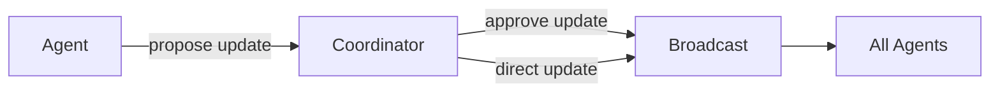
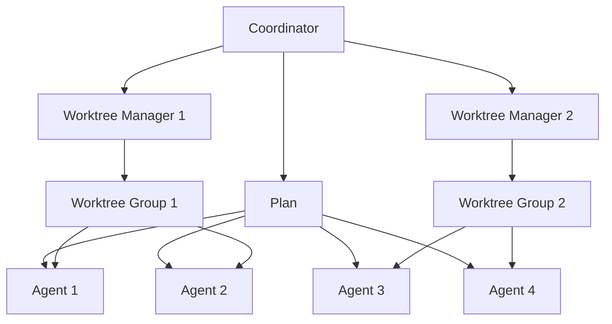
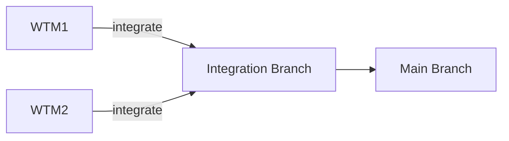
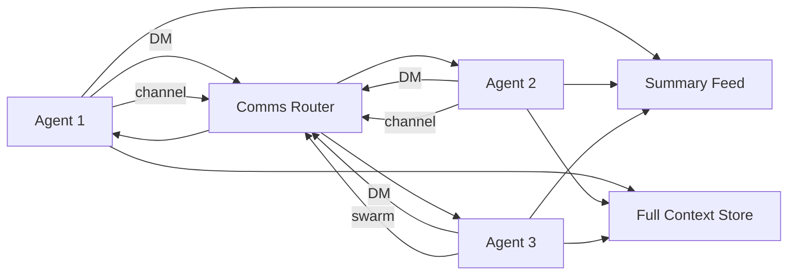
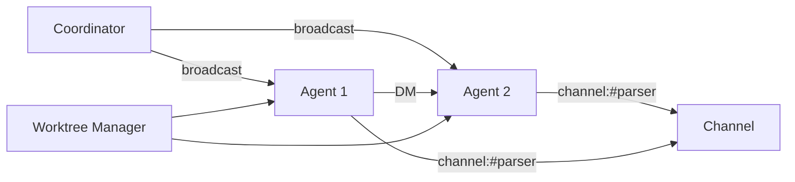
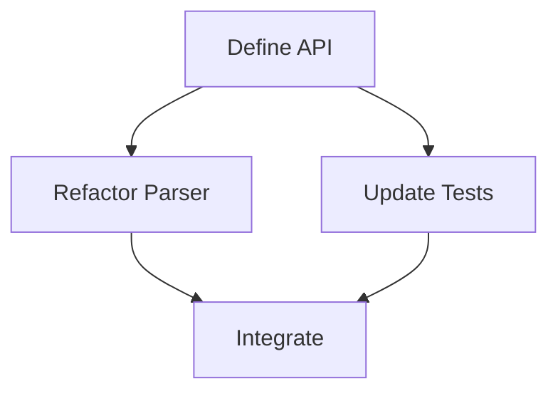

# Swarm Architecture (Proposed)

Status: Proposed

This document captures the intended swarm coordination design based on the current
project direction. It describes how agents coordinate, plan, communicate, and
integrate work with optional git worktrees.

## Goals

- Parallel work across many agents without locks.
- A comprehensive initial plan, but allowed to evolve as work progresses.
- Plan distribution is out-of-band (not stored in the repo).
- Explicit coordination via broadcast updates, DMs, and channels.
- Optional git worktrees used only when they make sense.
- Integration handled by worktree managers, not the coordinator.

## Roles

### Coordinator

- Creates the initial, comprehensive plan.
- Spawns all subagents and assigns scopes.
- Can shut down agents and spawn replacements as needed.
- Is the only role allowed to spawn or stop agents.
- Decides if a git worktree is needed and groups agents per worktree.
- Reviews plan update proposals and broadcasts approved updates.
- Can issue plan updates directly when it discovers a plan issue.
- Does not perform merges or integration.

### Worktree Manager

- Owns a single worktree scope.
- Knows the full plan and the worktree scope.
- Coordinates work inside that worktree.
- Responsible for integration when that worktree scope is done.

### Agents

- Execute tasks in parallel.
- Receive the full plan plus their scoped instructions on spawn.
- Propose plan updates when they discover issues or new requirements.
- Coordinate directly with other agents via DM or channels.
- Emit lifecycle events when they start, finish, or stop unexpectedly.
- Cannot spawn or shut down other agents (including agents spawned by non-coordinator agents).

## Agent Lifecycle States

- spawned: session created, not yet ready.
- ready: plan and scope received, waiting for work.
- running: actively executing a task or tool.
- blocked: cannot proceed (dependency, conflict, or missing info).
- completed: assigned scope done, waiting for new assignment.
- failed: unrecoverable error, needs coordinator decision.
- stopped: intentionally shut down by coordinator.
- crashed: unexpected exit (no clean shutdown).

## Agent Lifecycle Notifications

- Each agent emits a completion event when its assigned scope is done.
- Each agent emits a stop event when it cannot continue or exits unexpectedly.
- The coordinator receives these events and decides next steps (respawn, rescope,
  shutdown, or mark complete).
- Lifecycle updates drive the swarm info widget status indicators.

## User Interaction

- The user primarily interacts with the coordinator.
- Other agents do not surface directly to the user unless the coordinator routes
  updates or requests.

## Plan Distribution and Updates

- Plan v1 is created by the coordinator and sent to all agents on spawn.
- Each agent keeps a local copy of the plan and tracks the plan version.
- Plan updates are proposed by agents and must be reviewed by the coordinator.
- Agents must request plan changes by DMing the coordinator.
- Only approved updates are broadcast to all agents.
- The plan is not stored in a repo file; it is distributed on spawn and via broadcast.
- Agents that miss a broadcast can request a plan resync from the coordinator.

Plan update flow:

## Worktree Usage

- Worktrees are optional and used only when isolation helps (large refactors,
  risky changes, or divergent dependencies).
- Most work should remain in the main workspace unless a worktree is justified.
- Many agents can share a single worktree.
- Each worktree has a Worktree Manager who owns integration.
- Each worktree is assigned a logical `swarm_id` so communication, plan updates,
  and UI views span all worktrees in the same swarm.

Worktree grouping:

Integration:

## Communication

Explicit agent-to-agent communication is required for coordination and conflict
resolution. The system supports:

- Direct messages (DMs)
- Swarm broadcast
- Topic channels (group chats)

All agents can broadcast and send DMs or channel messages.

All inter-agent communication is delivered as notifications (DMs, channel messages,
broadcasts, plan updates, intent notices, and lifecycle events). Notifications are
queued as soft interrupts and injected into the running agent at safe points, so
messages can be interleaved during a turn without starting a new turn.

Summary read and full context read are separate operations:

- Summary read: short activity feed (tool calls with intent, brief results, and
  optionally exposed thoughts).
- Full context read: explicit, heavy read of an agent's full context and tool
  outputs. This should be used sparingly to avoid context bloat.

Communication topology:

## UI (TUI)

Two real-time widgets accompany the swarm system: a swarm info widget and a plan
info widget. Both update continuously from event streams.

### Swarm info widget

- Graph view of agents, worktree managers, coordinator, and channels.
- Edges represent communication paths: DM, channel, and swarm broadcast.
- Nodes show status (idle, running, blocked) and current task or intent.
- Updates in real time based on communication events, lifecycle events, and tool intent events.

Swarm graph view:

### Plan info widget

- Graph view of the task DAG with dependencies.
- Nodes show owner, scope, and status (queued, running, done, blocked, failed).
- Checkpoints are shown as node badges or subnodes.
- Progress is visible through completed node count and critical path status.
- Updates in real time from plan broadcasts and task status events.

Plan graph view:

## File Touch and Intent

- File touch notifications are used for conflict detection.
- An optional short `intent` field on tool calls is planned to provide a
  preemptive summary of what a tool is trying to do.
- Intent should be brief and is used to build the summary activity feed.

## Conflict Handling (No Locks)

- The system is optimistic by default (no locks).
- Conflicts should prompt the involved agents to communicate directly.
- Coordination happens via DM or channel, not through the coordinator.

## Summary

This design emphasizes parallelism, explicit communication, and optional worktree
isolation. The coordinator is responsible for planning and plan updates; worktree
managers are responsible for integration; agents collaborate directly to resolve
conflicts.
