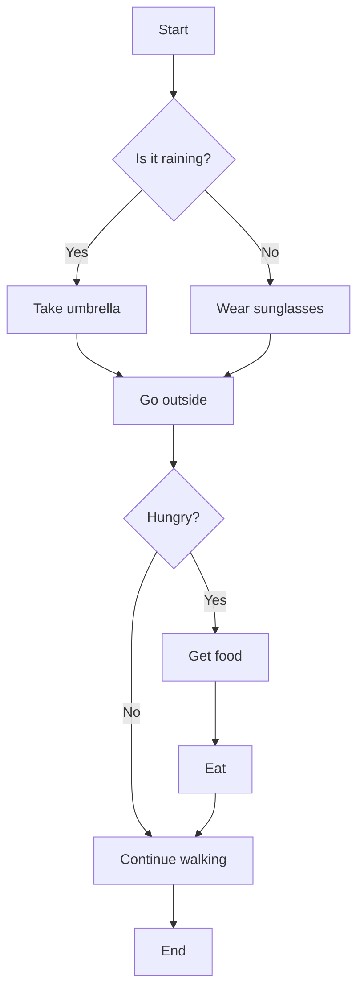

# Sample Flowchart

```mermaid
flowchart TD
    A[Start] --> B{Is it raining?}
    B -->|Yes| C[Take umbrella]
    B -->|No| D[Wear sunglasses]
    C --> E[Go outside]
    D --> E
    E --> F{Hungry?}
    F -->|Yes| G[Get food]
    F -->|No| H[Continue walking]
    G --> I[Eat]
    I --> H
    H --> J[End]
```
